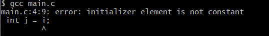

# Compiler-Principle Course Project

This project implements a compiler that can compile a C-like language into binary codes. It is based on flex, yacc, LLVM.

## Dependency

1. LLVM
    -   On Windows: We recommend using VS2019 on Windows. For instructions on installing LLVM on Windows using Visual Studio, refer to [Getting Started with the LLVM System using Microsoft Visual Studio](https://llvm.org/docs/GettingStartedVS.html).
    -   On Ubuntu: You can directly use `sudo apt install llvm` to install LLVM on your computer. (Maybe you need to add some PPAs and update packages beforehand.)
2. flex&yacc
    -   


## Grammar

Due to the complexity of C language, to simplify our project task, we design a C-like language which, to some extent, is the subset of the original C language by introducing several restrictions:

1. No macros (Commands including `#include`, `#define` and other macros are not allowed. Functions like `printf` and `scanf` should be directly used without `#include <stdio.h>`).

2. All codes should be placed in one single source file. (Since we don't allow any macro including `#include`)

3. Pointer type should be declared using `ptr` instead of `*`, because the syntax parser cannot tell whether `a * b` means "`a` multiplies `b`" or "variable `b` is a pointer pointing to a memory location of type `a`".

    ```C
    typedef int a;	//"a" is an alias for type "int"
    float a;		//"a" is a variable of type "float"
    a * b;			//What does this mean? Expression "a * b" or declaration "int* b"?
    ```

    So, in our language, pointer types should be declared this way:

    ```C
    //In C language, the type of p is "int*", the type of q is "int"
    int * p, q;		//Illegal in our language.
    
    //In our language, the type of both p and q is "int ptr"
    int ptr p, q;	//Legal.
    ```

4. Expressions with a single variable name and empty variable declarations will result in reduce-reduce conflicts. For example:

    ```C
    typedef int a;	//"a" is an alias for type "int"
    float a;		//"a" is a variable of type "float"
    a;				//What does this mean? An expression or an empty declaration "int;"?
    ```

    One resolution is to inhibit empty variable declarations. However, in our language, we resolve this conflict by make yacc prefer expressions with a single variable name to empty variable declarations.

    ```C++
    /*In function body*/
    {
    	typedef int a;	//"a" is an alias for type "int"
    	float a;		//"a" is a variable of type "float"
    	a;				//OK. It semantic meaning is an expression with the identifier "a"
    }
    ```

    However, since no statements except for declarations are allowed to appear in the global field, in this case, `a;` will be treated as an empty declaration:

    ```C
    /*global field*/
    typedef int a;		//"a" is an alias for type "int"
    float a;			//"a" is a variable of type "float"
    a;					//OK. This is an empty declaration equivalent to "int;"
    ```

5. For simplicity, we rewrite the grammar of array definition. In C, arrays are defined as follows:

    ```C
    int a[20], b[10], c[20];
    ```

    In our language, arrays are defined as follow:

    ```C
    int[20] a, c;
    int[10] b;
    ```

    The following code shows how to define arrays of float pointers:

    ```C
    float ptr[10] FPtr1D;
    float ptr[5][5] FPtr2D;
    ```

    The following code shows how to define an array of 20 pointers pointing to bool arrays:

    ```C
    bool[10]ptr[20] ArrayPtr1D;
    ```

    The advantage of this grammar rule is that, in variable declarations, types and names can be split into different places, thus enabling the parser to deal with them separately.

6. Initialize variables of complex types when they are declared are not allowed, because to support the following declaration:

    ```C
    int[2][2] a = {{1,2}, {3,4}};
    ```

    , we need a grammar that can recognize the following language:

    -   On the left hand side of "=", there is a string consisting of matched bracket pairs, and there should not be any nesting.
    -   On the right hand side of "=", there is a string consisting of matched nested brace pairs.
    -   The number of bracket pairs equals to the nesting level of brace pairs

    Unfortunately, this language is not context-free. Therefore, our language only support initializations of simple type variables.

    ```C
    int a = 1;						//Legal
    int[2][2] b;					//Legal
    int[2][2] c = {{1,2}, {3,4}};	//Illegal
    int[2] d = {1,2};				//Illegal
    int[2] e = 1;					//Illegal
    struct {int x, y;} p = {1,2};	//Illegal
    ```

7. For simplicity, in our language, a semicolon should be added to the end of a pair of braces. In C, there is no need to write semicolons after braces.

    ```C
    int abs(int x){
    	if (x > 0) {
    		return x;
    	};
    	else {
    		return -x;
    	};
    };
    ```

8. In our language, expressions are a special type of statements. Not all statements have return values, but expressions must have return values (including `void` value).

    Variable declarations, function declarations are statements, but not expressions. This means they do not have return values, and should not exist in places where expressions are expected.

    For example, `for` statement expects one statement, two expressions and one statement:

    ```C
    for (statement; expression; expression) statement;
    ```

    The following code shows some legal and illegal usage of `for` statement:

    ```C
    for (int i = 0; i < n; i++) sum += i;	//Legal
    
    int i; for (i = 0; foo1(i); foo2(i)) foo3(i);	//Legal
    
    for (int i = 0; int j = i; i++);		//"int j = i" is illegal
    
    for (int i = 0; i < n; int j = i++);	//"int j = i++" is illegal
    
    for (int i = 0; i < n; i++){			//Legal
        int i = 10;	//We allow redefining variables in the loop body
    };
    ```

9. Array types in C are very complex and confusing. Let's look at the following two examples:

    ```C
    void foo1(void) {
    	int a[2];
    	a[0] = 1;
    	// %1 = getelementptr inbounds [2 x i32], [2 x i32]* %0, i32 0, i32 0
    	// store i32 1, i32* %1
    }
    void foo2(int a[]) {
    	a[0] = 1;
    	// store i32* %0, i32** %3, align 8
    	// %4 = load i32*, i32** %3, align 8
    	// %5 = getelementptr inbounds i32, i32* %4, i64 0
    	// store i32 1, i32* %5, align 4
    }
    ```

    Although `a` is an array in both functions, the IR codes totally different. In the first example, `a` is a locally defined array. Therefore, the type of `a` is an array type. In the second example, `a` is a parameter. Therefore, the type of `a` is `int*` according to the C standard.

    In our language, to simplify this problem and comply with the C standard simultaneously, when `a` is passed as an parameter, instead of treating it as a `int*` pointer, we will treat it as an array as if it is defined locally. However, modifying `a[0]` won't result in the modification of the local stack, but rather the modification of the passed array (This complies with the C standard).

In conclusion, The grammar of our language is:

- Terminals:

  ```
  COMMA			","
  DOT				"."
  SQUOTE			"\'"
  DQUOTE			"\""
  SEMI			";"
  LPAREN			"("
  RPAREN			")"
  LBRACKET		"["
  RBRACKET		"]"
  LBRACE			"{"
  RBRACE			"}"
  SHLEQ			"<<="
  SHL				"<<"
  SHREQ			">>="
  SHR				">>"
  EQ				"=="
  GE				">="
  GT				">"
  LE				"<="
  LT				"<"
  NEQ				"!="
  NOT				"!"
  ASSIGN			"="
  AND				"&&"
  BANDEQ			"&="
  BAND			"&"
  OR				"||"
  BOREQ			"|="
  BOR				"|"
  ARW				"->"
  BXOREQ			"^="
  BXOR			"^"
  BNOT			"~"
  DADD			"++"
  ADDEQ			"+="
  ADD				"+"
  DSUB			"--"
  SUBEQ			"-="
  SUB				"-"
  MULEQ			"*="
  MUL				"*"
  DIVEQ			"/="
  DIV				"/"
  MODEQ			"%="
  MOD				"%"
  QUES			"?"
  COLON			":"
  STRUCT			"struct"
  TYPEDEF			"typedef"
  CONST			"const"
  ENUM			"enum"
  PTR				"ptr"
  IF				"if"
  ELSE			"else"
  FOR				"for"
  WHILE			"while"
  DO				"do"
  SWITCH			"switch"
  CASE			"case"
  DEFAULT			"default"
  CONTINUE		"continue"
  BREAK			"break"
  RETURN			"return"
  SIZEOF			"sizeof"
  REAL			[0-9]+\.[0-9]+
  INTERGER		[0-9]+
  IDENTIFIER		[a-zA-Z_][a-zA-Z0-9_]*
  STRING
  CHARACTER
  ```

- Rules:

  ```
  Program ->		Decls
  
  Decls ->		Decls Decl | ε
  
  Decl ->			FuncDecl | VarDecl | TypeDecl | ε
  
  FuncDecl ->		VarType IDENTIFIER LPAREN ArgList RPAREN SEMI |
  				VarType IDENTIFIER LPAREN ArgList RPAREN FuncBody
  
  FuncBody ->		LBRACE Stmts RBRACE
  
  VarDecl ->		VarType VarList SEMI
  
  VarList ->		_VarList COMMA VarInit | VarInit | ε
  
  _VarList ->		_VarList COMMA VarInit | VarInit
  
  VarInit ->		IDENTIFIER |
  				IDENTIFIER ASSIGN Expr
  
  TypeDecl ->		TYPEDEF VarType IDENTIFIER SEMI
  
  VarType ->		_VarType |
  				CONST _VarType
  
  _VarType ->		BuiltInType |
  				STRUCT LBRACE FieldDecls RBRACE |
  				ENUM LBRACE EnmList RBRACE
  				_VarType PTR |
  				_VarType LBRACKET INTEGER RBRACKET |
  				IDENTIFIER
  
  BuiltInType ->	BOOL | SHORT | INT | LONG | CHAR | FLOAT | DOUBLE | VOID
  
  FieldDecls ->	FieldDecls FieldDecl | ε
  
  FieldDecl ->	VarType MemList SEMI | SEMI
  
  MemList ->		_MemList COMMA IDENTIFIER | IDENTIFIER | ε
  
  _MemList ->		_MemList COMMA IDENTIFIER | IDENTIFIER
  
  EnmList ->		_EnmList COMMA Enm | Enm | ε
  
  _EnmList ->		_EnmList COMMA Enm | Enm
  
  Enm ->			IDENTIFIER |
  				IDENTIFIER ASSIGN INTEGER
  
  ArgList ->		_ArgList COMMA Arg | Arg | ε
  
  _ArgList ->		_ArgList COMMA Arg | Arg
  
  Arg ->			VarType IDENTIFIER | VarType
  
  Block ->		LBRACE Stmts RBRACE
  
  Stmts ->		Stmts Stmt | ε
  
  Stmt ->			Expr SEMI |
  				IfStmt |
  				ForStmt |
  				WhileStmt |
  				DoStmt |
  				SwitchStmt |
  				BreakStmt |
  				ContinueStmt |
  				ReturnStmt |
  				Block |
  				VarDecl |
  				TypeDecl |
  				SEMI
  
  IfStmt ->		IF LPAREN Expr RPAREN Stmt ELSE Stmt |
  				IF LPAREN Expr RPAREN Stmt
  
  ForStmt ->		FOR LPAREN Expr SEMI Expr SEMI Expr LPAREN Stmt |
  				FOR LPAREN VarDecl Expr SEMI Expr LPAREN Stmt
  
  WhileStmt ->	WHILE LPAREN Expr RPAREN Stmt |
  
  DoStmt ->		DO Stmt SEMI WHILE LPAREN Expr RPAREN
  
  SwitchStmt->	SWITCH LPAREN Expr RPAREN LBRACE CaseList RBRACE
  
  CaseList ->		CaseList CaseStmt | ε
  
  CaseStmt ->		CASE Expr COLON Stmts | DEFAULT COLON Stmts
  
  ContinueStmt ->	CONTINUE SEMI
  
  BreakStmt ->	BREAK SEMI
  
  ReturnStmt->	RETURN SEMI | RETURN Expr SEMI
  
  Expr ->			LPAREN Expr RPAREN |
  				Expr LBRACKET Expr RBRACKET |
  				SIZEOF LPAREN Expr RPAREN |
  				SIZEOF LPAREN VarType RPAREN |
  				IDENTIFIER LPAREN ExprList RPAREN |
  				Expr DOT IDENTIFIER |
  				Expr ARW IDENTIFIER |
  				ADD Expr |
  				SUB Expr |
  				LPAREN VarType RPAREN Expr |
  				DADD Expr |
  				Expr DADD |
  				DSUB Expr |
  				Expr DSUB |
  				MUL Expr |
  				BAND Expr |
  				NOT Expr |
  				BNOT Expr |
  				Expr DIV Expr |
  				Expr MUL Expr |
  				Expr MOD Expr |
  				Expr ADD Expr |
  				Expr SUB Expr |
  				Expr SHL Expr |
  				Expr SHR Expr |
  				Expr GT Expr |
  				Expr GE Expr |
  				Expr LT Expr |
  				Expr LE Expr |
  				Expr EQ Expr |
  				Expr NEQ Expr |
  				Expr BAND Expr |
  				Expr BXOR Expr |
  				Expr BOR Expr |
  				Expr AND Expr |
  				Expr OR Expr |
  				Expr QUES Expr COLON Expr |
  				Expr ASSIGN Expr |
  				Expr DIVEQ Expr |
  				Expr MULEQ Expr |
  				Expr MODEQ Expr |
  				Expr ADDEQ Expr |
  				Expr SUBEQ Expr |
  				Expr SHLEQ Expr |
  				Expr SHREQ Expr |
  				Expr BANDEQ Expr |
  				Expr BXOREQ Expr |
  				Expr BOREQ Expr |
  				IDENTIFIER |
  				Constant
  
  ExprList ->		_ExprList COMMA Expr | Expr | ε
  
  _ExprList ->	_ExprList COMMA Expr | Expr
  
  Constant ->		TRUE |
  				FALSE |
  				CHARACTER |
  				INTEGER |
  				REAL
  ```
  
  

## LLVM Manual

1. A well formed basic block is formed of a list of non-terminating instructions **followed by a single terminator instruction**. Terminator instructions **may not occur** in the middle of basic blocks, and must terminate the blocks.

2. Global variables define regions of memory allocated at compilation time instead of run-time. Global variable definitions must be initialized.

   
