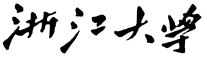
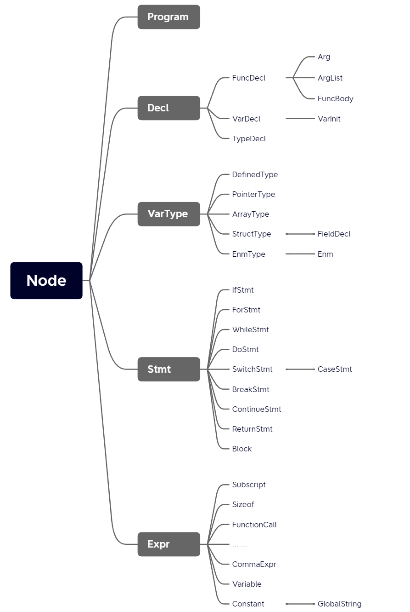
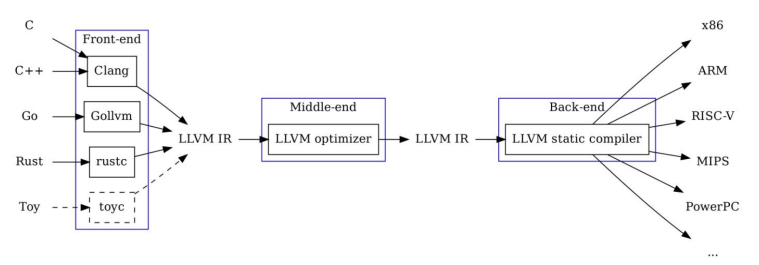
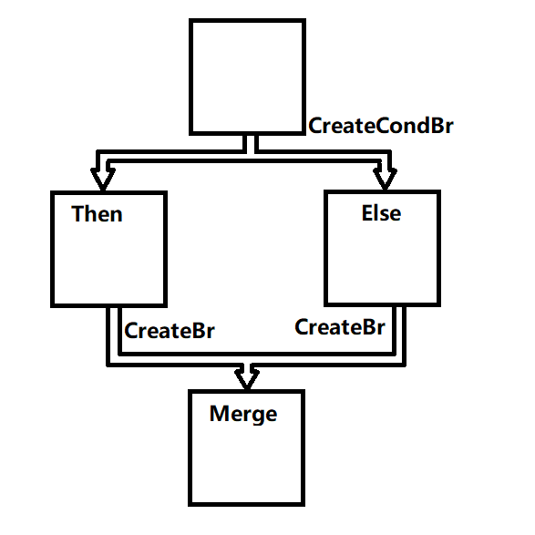
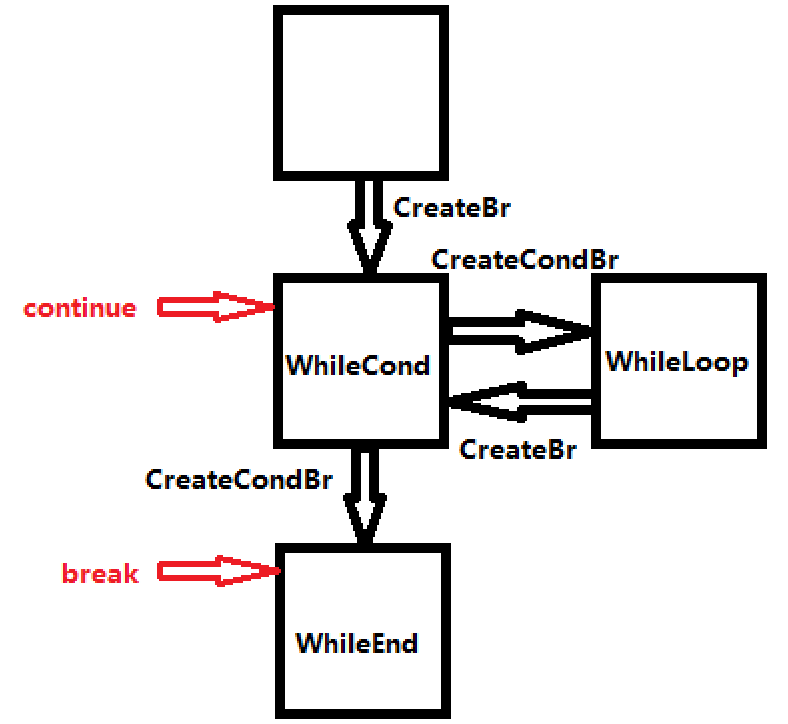
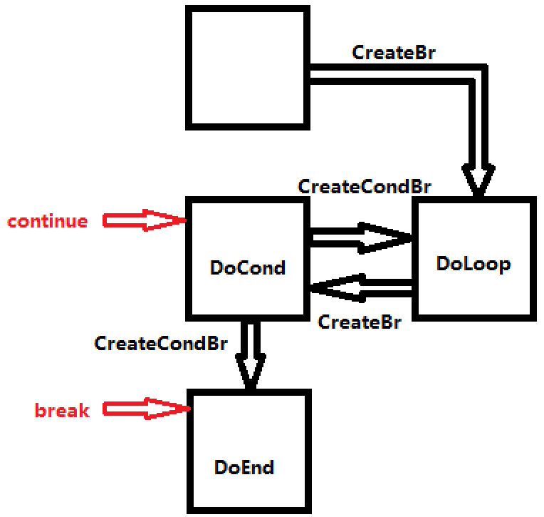
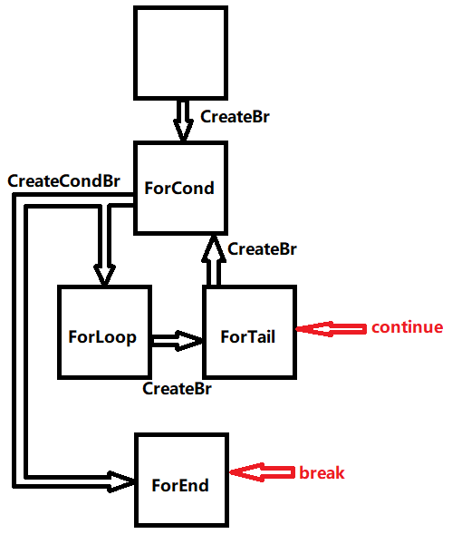

 



 

<h1><center>本科实验报告</center></h1>

 

 

<center><font size="5">课程名称：<u>&nbsp;&nbsp;&nbsp;&nbsp;&nbsp;&nbsp;&nbsp;&nbsp;&nbsp;&nbsp;&nbsp;编译原理&nbsp;&nbsp;&nbsp;&nbsp;&nbsp;&nbsp;&nbsp;&nbsp;&nbsp;&nbsp;&nbsp;</u></font></center>

<center><font size="5">姓名学号：<u>&nbsp;尤锦江&nbsp;3190102352&nbsp;</u></font></center>

<center><font size="5">&nbsp;&nbsp;&nbsp;&nbsp;&nbsp;&nbsp;&nbsp;&nbsp;&nbsp;&nbsp;&nbsp;&nbsp;&nbsp;&nbsp;&nbsp;&nbsp;&nbsp;&nbsp;&nbsp;<u>&nbsp;张之昀&nbsp;3190103273&nbsp;</u></font></center>

<center><font size="5">&nbsp;&nbsp;&nbsp;&nbsp;&nbsp;&nbsp;&nbsp;&nbsp;&nbsp;&nbsp;&nbsp;&nbsp;&nbsp;&nbsp;&nbsp;&nbsp;&nbsp;&nbsp;&nbsp;<u>&nbsp;陈一航&nbsp;3190100774&nbsp;</u></font></center>

<center><font size="5">学&nbsp;&nbsp;&nbsp;&nbsp;&nbsp;&nbsp;&nbsp;&nbsp;院：<u>&nbsp;&nbsp;&nbsp;&nbsp;&nbsp;&nbsp;&nbsp;&nbsp;&nbsp;竺可桢学院&nbsp;&nbsp;&nbsp;&nbsp;&nbsp;&nbsp;&nbsp;&nbsp;&nbsp;</u></font></center>

<center><font size="5">专&nbsp;&nbsp;&nbsp;&nbsp;&nbsp;&nbsp;&nbsp;&nbsp;业：<u>&nbsp;&nbsp;&nbsp;计算机科学与技术&nbsp;&nbsp;&nbsp;</u></font></center>

<center><font size="5">指导老师：<u>&nbsp;&nbsp;&nbsp;&nbsp;&nbsp;&nbsp;&nbsp;&nbsp;&nbsp;&nbsp;&nbsp;&nbsp;&nbsp;&nbsp;&nbsp;冯雁&nbsp;&nbsp;&nbsp;&nbsp;&nbsp;&nbsp;&nbsp;&nbsp;&nbsp;&nbsp;&nbsp;&nbsp;&nbsp;&nbsp;&nbsp;</u></font></center>

<center><font size="5"><u>&nbsp;&nbsp;2022&nbsp;&nbsp;</u>年<u>&nbsp;&nbsp;5&nbsp;&nbsp;</u>月<u>&nbsp;&nbsp;16&nbsp;&nbsp;</u>日</font></center>

<div style="page-break-after:always"></div>


<h2><center>浙江大学实验报告</center></h2>

## 〇、序言

本次实验完成了一个C语言的编译器，能够分析C语言的语法，并将其编译至LLVM IR，最后再编译至目标代码（`.o`文件）。我们实现的C编译器支持以下C语言特性：

- **所有C语言基本语句**。包括`if`, `for`, `while`, `do`, `switch`, `case`, `break`, `continue`, `return`。
- **类型系统**。基本数据类型包括`bool`, `char`, `short`, `int`, `long`, `float`, `double`, `void`。复杂数据类型`array`, `struct`, `enum`。支持`typedef`。
- **递归式结构体**。结构体内可以定义指向自己类型的指针，从而实现链表。

- **指针类型**。支持任意类型的指针类型，例如`int ptr`, `struct{int x, y;} ptr`。并且支持`&`, `*`, `->`等指针运算。
- **类型转换**。我们的编译器严格按照C语言的类型转换机制设计。包括隐式类型转换，例如`int+float->float`, `pointer+int->pointer`；强制类型转换，例如`(int)1.0`, `(double ptr)malloc(8)`。
- **左值和右值**。我们的编译器可以编译C语言支持的任意表达式，例如`*p<<=(c?a:b)[3]=st->x+sizeof(double array(5));`。运算符优先级参考[C Operator Precedence](https://en.cppreference.com/w/c/language/operator_precedence)。
- **可变长参数列表**。例如`void sum(int n, ...);`
- **函数先声明后定义**。编译器会检查声明和定义的类型是否一致。若函数只有声明，则由链接器负责链接外部函数。
- **调用C标准库的函数**。只要提前声明即可。例如`void ptr malloc(long)`, `int printf(char ptr, ...)`。
- **符号表作用域**。我们的编译器允许在`if`, `for`, `while`, `do`, `switch`以及语句块`{}`内定义变量，并且可以覆盖外层作用域的重名变量。变量的作用域只在语句块内。
- **编译器优化**。支持`-O0`, `-O1`, `-O2`, `-O3`, `-Os`, `-Oz`优化选项。

### 0.1 依赖项


### 0.2 安装说明


### 0.3 工程搭建 & 编译


### 0.4 使用手册


### 0.5 代码规范

由于本次实验中需要为AST定义大量的类。每个类还有不同的成员变量。为了对变量加以区分，我们做如下代码规范：

- 所有AST结点类型，都定义在`AST`命名空间内。
- 所有AST结点类型的名称都和对应的CFG的非终结符保持一致。
- 所有AST结点类型的成员变量的名称都以**一个下划线**开头。
- 所有AST结点类型的方法的参数都以**两个下划线**开头。

## 一、词法分析

编译器的词法分析（lexical analysis）阶段可将源程序读作字符文件并将其分为若干个记号。典型的记号有：关键词（key word），例如`if`和`while`，它们是字母的固定串；标识符（identifier）是由用户定义的串，它们通常由字母和数字组成并由一个字母开头；特殊符号（special symbol）如算数符号`+`和`*`、一些多字符符号，如`>=`和`<>`。

### 1.1 正则表达式

Lex是一个词法分析程序生成器，其输入为包含了正则表达式的`.l`文件和每个表达式被匹配时采取的动作。其中正则表达式的Lex约定如下：

| 格式  | 含义                           |
| ----- | ------------------------------ |
| a     | 字符a                          |
| "a"   | 即使a是一个元字符，它仍是字符a |
| \a    | 即使a是一个元字符，它仍是字符a |
| a*    | a的零次或多次重复              |
| a+    | a的一次或多次重复              |
| a?    | 一个可选的a                    |
| a\|b  | a或b                           |
| (a)   | a本身                          |
| [abc] | 字符a、b或c中的任一个          |
| [a-d] | 字符a、b、c或d中的任一个       |
| [^ab] | 除了a或b外的任一个字符         |
| .     | 除了新行之外的任一个字符       |
| {xxx} | 名字xxx表示的正则表达式        |

### 1.2 Lex具体实现

Lex输入文件由三个部分组成：定义（defination）集，规则（rule）集以及辅助程序（auxiliary）集或用户程序（user routine）集。

```apl
{definations}
%%
{rules}
%%
{auxiliary routines}
```

#### 1.2.1 定义部分

定义部分包括了必须插到第一部分`%{`和`%}`之间的C代码，包括头文件定义和逃逸字符返回函数（逃逸字符的匹配在规则部分）

```c
%{
#include "AST.hpp"
#include "Parser.hpp"
#include <stdio.h>
#include <string>
#include <iostream>
extern "C" int yywrap() {return 1;}

char Escape2Char(char ch){
	switch(ch){
	case 'a': return '\a';
	case 'b': return '\b';
	case 'f': return '\f';
	case 'n': return '\n';
	case 'r': return '\r';
	case 't': return '\t';
	case 'v': return '\v';
	case '\\': return '\\';
	case '\'': return '\'';
	case '\"': return '\"';
	default:
		if ('0'<=ch && ch<='9')
			return (char)(ch-'0');
		else
			return ch;
	}
}
%}
```

#### 1.2.2 规则部分

* 匹配关键字、运算符和界符时，只需要用固定字符的正则表达式匹配。

```c
","														{return COMMA;}
"..."													{return ELLIPSES;}
"."														{return DOT;}
";"														{return SEMI;}
...
"/"														{return DIV;}
"%="													{return MODEQ;}
"%"														{return MOD;}
"?"														{return QUES;}
":"														{return COLON;}

"struct"												{return STRUCT;}
"typedef"												{return TYPEDEF;}
"const"													{return CONST;}
...
"long"													{return LONG; }
"char"													{return CHAR; }
"float"													{return FLOAT; }
"double"												{return DOUBLE; }
"void"													{return VOID; }
```

* 匹配注释、变量值等时需要用到非固定字符串的正则匹配。需要额外保存值的表达式用到的函数包括：

  * `yytext`：返回子串
  * `yyleng`：返回子串长度
  * `yylval`：创建相关类型的储值空间

  Lex输出总是首先将可能的最长子串与规则相匹配。如果某个子串可与两个或更多的规则匹配，则Lex的输出将找出列在行为部分的第一个规则。例如匹配浮点数应放在匹配整数之前。

```c
[ \t\n]													{ ; }
"/*"[^*]*[*]+([^*/][^*]*[*]+)*"/"						{ ; }
"//".*													{ ; }
"\'"\\."\'"												{ 
															yylval.cVal = Escape2Char(yytext[2]);
															return CHARACTER; 
														}
"\'"[^\\']"\'"											{ 
															yylval.cVal = yytext[1];
															return CHARACTER; 
														}
"\'"													{return SQUOTE; }
"\""(\\.|[^"\\])*"\""									{
															yylval.strVal = new std::string("");
															for (int i = 1; i <= yyleng-2; i++)
																if (yytext[i] == '\\'){
																	i++;
																	yylval.strVal->push_back(Escape2Char(yytext[i]));
																}else{
																	yylval.strVal->push_back(yytext[i]);
																}
															return STRING;
														}
"\""													{return DQUOTE;}
[a-zA-Z_][a-zA-Z0-9_]*									{ 
															yylval.sVal = new std::string(yytext, yyleng);
															return IDENTIFIER; 
														} 
[0-9]+\.[0-9]+											{ 
															double dtmp;
															sscanf(yytext, "%lf", &dtmp);
															yylval.dVal = dtmp;
															return REAL; 
														}
[0-9]+													{
															int itmp;
															sscanf(yytext, "%d", &itmp);
															yylval.iVal = itmp; 
															return INTEGER; 
														}
%%
```

## 二、语法分析

语法分析程序从扫描程序中获取记号形式的源代码，并完成定义程序结构的语法分析，这与自然语言中句子的语法分析类似。语法分析定义了程序的结构元素及其关系。语法分析的结果表示为抽象语法树（Abstract Syntax Tree）。

### 2.1 支持语法

我们的CFG语法支持如序言所提的C语言特性，但是部分语法有所区别：

* 不支持宏定义。不支持`#include`和`#define`等宏定义。若要使用`printf`等函数，需要先声明再直接使用：

  ```c
  /*This is an example that prints "Hello World!"*/
  int printf(char ptr, ...);
  int main(void){
  	printf("Hello World!\n");
  	return 0;
  }
  ```

* 所有代码应在一个源文件中

* 指针类型应该用`ptr`进行声明。这与C语言用`*`来声明不同，因为我们的语法分析程序不能区分`a*b`是”a乘以b“还是"a类型的指针变量b"。

  ```c
  typedef int a;	//"a" is an alias for type "int"
  float a;		//"a" is a variable of type "float"
  a * b;			//What does this mean? Expression "a * b" or declaration "int* b"?
  ```

  我们的语言中，指针变量应如下定义:

  ```c
  //In C language, the type of both p and q is "int ptr"
  int * p, * q;	//Illegal in our language.
  
  //In our language, the type of both p and q is "int ptr"
  int ptr p, q;	//Legal.
  ```

* 只有单个变量名的声明会导致规约-规约冲突

  ```c
  typedef int a;	//"a" is an alias for type "int"
  float a;		//"a" is a variable of type "float"
  a;				//What does this mean? An expression or an empty declaration "int;"?
  ```

  因此，我们把只有单个变量名的声明默认为空的变量声明而不是表达式：

  ```c
  typedef int a;	//"a" is an alias for type "int"
  float a;		//"a" is a variable of type "float"
  a;				//OK. This is an empty declaration equivalent to "int;"
  ```

* 为了简化数组语法，在我们的语言中，数组应照如下定义：

  ```c
  int ptr array(20) a;	//an array of integer pointers
  int array(20) ptr a;	//an integer array pointer
  int ptr array(5) array(5) a;		//a 2D array of integer pointers
  int array(5) ptr array(5) b;		//a 1D array of 1D integer array pointers
  int array(5) array(5) ptr c;		//a 2D integer array pointer
  struct {int x, y;} ptr array(10) d;	//a 1D array of struct pointers
  ```

  这样语法分析器就可以分开处理变量声明的类型和变量名称。

* 不支持复杂变量类型在定义时就初始化。例如：

  ```c
  struct {double array(3) norm; double curve;} array(2) array(2) a
      = {{{{1,2,3}, 4}, {{5,6,7}, 8}}, {{{1,2,3}, 4}, {{5,6,7}, 8}}};
  ```

  为了支持上述语法，编译器需要做很多工作判断该语法是否合法。因此我们仅支持简单类型变量的初始化。若编程者要初始化复杂类型变量，需要使用循环语句。

  ```c
  int a = 1;									//Legal
  double r = 5;								//Legal, integer 5 will be cast to double
  int array(2) array(2) b;					//Legal
  int array(2) array(2) c = {{1,2}, {3,4}};	//Illegal
  int array(2) d = {1,2};						//Illegal
  int array(2) e = 1;							//Illegal
  struct {int x, y;} p = {1, 2};				//Illegal
  ```

* 我们的语言定义表达式是一种特殊的语句。表达式有返回值，但语句不一定有返回值。在期待输入表达式的地方，不能输入变量声明，因为变量声明是语句而非表达式。

  例如，`for`语句需要的表达式和语句如下：

  ```c
  for (statement; expression; expression) statement;
  ```

  一些合法和非法的`for`语句：

  ```c
  for (int i = 0; i < n; i++) sum += i;	//Legal
  
  int i; for (i = 0; foo1(i); foo2(i)) foo3(i);	//Legal
  
  for (int i = 0; int j = i; i++);		//"int j = i" is illegal, because it is not an expression
  
  for (int i = 0; i < n; int j = i++);	//"int j = i++" is illegal, because it is not an expression
  
  for (int i = 0; i < n; i++){			//Legal
      int i = 10;	//Legal. We allow redefining variables in the loop body
  };
  ```

* 和C一样，我们也有变量类型等价。但是如下的代码不能编译（这和C语言的特性是一样的）：

  ```c
  struct {int x, y;} test(void){
  	struct {int x, y;} a;
  	struct {int x, y;} b;
  	a = b;		//Error
  	return a;	//Error
  }
  ```

  应该先使用`typedef`定义结构类型，然后再用这个被定义过的结构类型去定义变量：

  ```c
  typedef struct {int x, y;} PointTy;
  PointTy test(void){
  	PointTy a;
  	PointTy b;
  	a = b;		//OK
  	return a;	//OK
  }
  ```

  递归的结构定义必须使用`typedef`：

  ```c
  typedef struct {
  	int Value;
  	Node ptr Next;
  } Node;
  ```

* C语言中数组的处理十分复杂。例如下面：

  ```c
  void foo1(void) {
  	int a[2];
  	a[0] = 1;
  	// %1 = getelementptr inbounds [2 x i32], [2 x i32]* %0, i32 0, i32 0
  	// store i32 1, i32* %1
  }
  void foo2(int a[]) {
  	a[0] = 1;
  	// store i32* %0, i32** %3, align 8
  	// %4 = load i32*, i32** %3, align 8
  	// %5 = getelementptr inbounds i32, i32* %4, i64 0
  	// store i32 1, i32* %5, align 4
  }
  ```

  尽管在两个函数中`a`都是数组，但它们的中间代码完全不同。在第一个例子中，`a`是一个本地定义的数组；在第二个例子中，`a`是参数，因此`a`是`int*`类型的。

  为了简化，我们规定作为函数参数传入的`int array(n)`也作为`int array(n) ptr`类型而不是`int *`，函数内部把其当作本地定义的数组。其中和C标准一致的是，修改`a[0]`不会修改本地栈而是传入的数组。

### 2.2 Yacc

我们使用Yacc作为我们的分析程序生成器，其输入是一个说明文件（`.y`后缀），并产生一个由分析程序的C源代码组成的输出文件，格式为：

```apl
{definations}
%%
{rules}
%%
{auxiliary routines}
```

#### 2.2.1 定义部分

定义部分定义了CFG语法中`non-terminal`的类型、`terminal`的TOKEN和运算符的优先级。定义优先级时，`%left`，`%right`和`%nonassoc`定义结合性，越后定义的运算优先级高。

```c++
%nonassoc IF
%nonassoc ELSE
%left	COMMA //15
%left	FUNC_CALL_ARG_LIST
%right	ASSIGN ADDEQ SUBEQ MULEQ DIVEQ MODEQ SHLEQ SHREQ BANDEQ BOREQ BXOREQ //14
%right	QUES COLON //13
%left	OR//12
%left	AND//11
%left	BOR//10
%left	BXOR//9
%left	BAND//8
%left	EQ NEQ//7
%left	GE GT LE LT//6
%left	SHL SHR//5
%left	ADD SUB//4
%left	MUL DIV MOD//3
%right	DADD DSUB NOT BNOT SIZEOF//2
%left	DOT ARW//1
```

#### 2.2.2 规则部分

每一条规约左边为规则，花括号内为C语言操作。`$$`为规约后压入栈的值，`$1`，...，`$n`为规约前栈中的值。如下为范例：

```yacas
Program:	Decls												{  $$ = new AST::Program($1); Root = $$;   }
			;
			
Decls:		Decls Decl											{  $$ = $1; $$->push_back($2);   }
			|													{  $$ = new AST::Decls();   }
			;
... ...
```

规则部分也可定义优先级，例如`+`既可以表示右结合的正号，也可以表示为左结合的加号。这在定义区无法定义完全，需要用`%prec`定义：

```yacas
Expr:		Expr LBRACKET Expr RBRACKET %prec ARW				{  $$ = new AST::Subscript($1,$3);   }  
			| ADD Expr	%prec NOT								{  $$ = new AST::UnaryPlus($2);   }
			| SUB Expr	%prec NOT								{  $$ = new AST::UnaryMinus($2);   }
			| LPAREN VarType RPAREN Expr %prec NOT				{  $$ = new AST::TypeCast($2,$4);   }
			| DADD Expr	%prec NOT								{  $$ = new AST::PrefixInc($2);   }
			| Expr DADD %prec ARW								{  $$ = new AST::PostfixInc($1);   }
			| DSUB Expr %prec NOT								{  $$ = new AST::PrefixDec($2);   }
			| Expr DSUB	%prec ARW								{  $$ = new AST::PostfixDec($1);   }
			| MUL Expr	%prec NOT								{  $$ = new AST::Indirection($2);   }
```

### 2.3 抽象语法树

语法分析程序的输出是抽象语法树，即称作抽象语法的快速计数法的树形表示。抽象语法树的每一个节点表示一种类型，我们定义的类型之间的继承关系如下：



#### 2.3.1 Node类

Node类是抽象语法树每个节点的纯虚类型，包括空的构造、析构函数和纯虚函数`CodeGen`

```c++
class Node {
	public:
		Node(void) {}
		~Node(void) {}
		virtual llvm::Value* CodeGen(CodeGenerator& __Generator) = 0;
};
```

#### 2.3.2 Program类

Program类是抽象语法树的根节点，一个程序由若干个声明组成。

```c++
class Program : public Node {
	public:
		Decls* _Decls;

		Program(Decls* _Decls) :_Decls(_Decls) {}
		~Program(void) {}
		llvm::Value* CodeGen(CodeGenerator& __Generator);
};
```

#### 2.3.3 Decl类

Decl类也是纯虚类型，包括函数、变量和类型的声明（定义）四个子类。

函数声明字段包括返回类型，函数名，参数列表和函数体（子类代码示例都省略了构造、析构和`CodeGen`函数）：

```c++
//Function declaration
	class FuncDecl : public Decl {
	public:
		//The return type of the function
		VarType* _RetType;
		//Its name
		std::string _Name;
		//The argument list of the function
		ArgList* _ArgList;
		//The function body (its implementation)
		//If no block is provided, FuncBody is set to be NULL,
		//meaning that this is just a function prototype declaration.
		FuncBody* _FuncBody;
	};
```

变量声明包括了变量类型和变量列表：

```c++
//Variable declaration
	class VarDecl : public Decl {
	public:
		//The variable type
		VarType* _VarType;
		//The variable list
		VarList* _VarList;

		VarDecl(VarType* __VarType, VarList* __VarList) :
			_VarType(__VarType), _VarList(__VarList) {}
		~VarDecl(void) {}
		llvm::Value* CodeGen(CodeGenerator& __Generator);
	};
```

类型声明字段包括了变量类型和变量名：

```c++
//Type declaration
	class TypeDecl : public Decl {
	public:
		//Variable type
		VarType* _VarType;
		//Its alias
		std::string _Alias;
	};
```

#### 2.3.4 VarType类

VarType类即变量类型类，包括字段常量类型`_isConst`和虚字段内置类型`isBuiltInType`、定义类型`isDefinedType`、指针类型`isPointerType`、数组类型`isArrayType`、结构类型`isStructType`、枚举类型`isEnumType`。

```c++
//Base class for variable type
	class VarType : public Node {
	public:
		//Whether this type is const
		bool _isConst;
		//Its LLVM type. It is initialized as NULL, and generated by function GetLLVMType.
		llvm::Type* _LLVMType;

		VarType(void) : _isConst(false), _LLVMType(NULL) {}
		~VarType(void) {}
		//Set this variable type to be constant.
		void SetConst(void) {
			this->_isConst = true;
		}
		//Return the corresponding instance of llvm::Type*.
		//Meanwhile, it will update _LLVMType.
		virtual llvm::Type* GetLLVMType(CodeGenerator& __Generator) = 0;
		//VarType class don't need an actual CodeGen function
		llvm::Value* CodeGen(CodeGenerator& __Generator) { return NULL; }
		//Determine class type
		virtual bool isBuiltInType(void) = 0;
		virtual bool isDefinedType(void) = 0;
		virtual bool isPointerType(void) = 0;
		virtual bool isArrayType(void) = 0;
		virtual bool isStructType(void) = 0;
		virtual bool isEnumType(void) = 0;
	};
```

#### 2.3.5 Stmt类

Stmt类即语句类，也是纯虚类型，包括条件语句、循环语句、选择语句等子类。

#### 2.3.6 Expr类

Expr的语义是表达式类，即有值的返回结构。我们定义的表达式包括常量表达式、变量表达式和操作符表达式等。

```c++
//Pure virtual class for expression
	class Expr : public Stmt {
	public:
		Expr(void) {}
		~Expr(void) {}
		//This function is used to get the "value" of the expression.
		virtual llvm::Value* CodeGen(CodeGenerator& __Generator) = 0;
		//This function is used to get the "pointer" of the instance.
		//It is used to implement the "left value" in C language,
		//e.g., the LHS of the assignment.
		virtual llvm::Value* CodeGenPtr(CodeGenerator& __Generator) = 0;
	};
```

### 2.4 抽象语法树可视化

## 三、语义分析

通过了词法分析和语法分析，不代表代码的语义正确。因此我们要对第二步得到的抽象语法树（AST）进行语义分析。

虽然语义分析和中间代码生成是相互独立的，但他们可以同步进行。`AST.cpp`中的代码一起完成了语义分析和中间代码生成的工作。

### 3.1 LLVM概述

LLVM(Low Level Virtual Machine)是以C++编写的编译器基础设施，包含一系列模块化的编译器组件和工具教练用来开发编译器前端和后端。

在本次实验中，我们将使用LLVM C++ API来完成C语言到LLVM-IR的转换。LLVM IR是LLVM的核心所在，通过将不同高级语言的前端翻译成LLVM IR进行优化、链接后再传给不同目标的后端转换成为二进制代码，前端、优化、后端三个阶段互相解耦，这种模块化的设计使得LLVM优化不依赖于任何源码和目标机器。



### 3.2 语义分析环境

在进行语义分析和IR生成之前，我们首先要搭建好环境，包括但不限于初始化上下文环境、初始化符号表等。我们创建了`CodeGenerator`类来完成语义分析环境的搭建。

#### 3.2.1  创建IR上下文环境

在`CodeGenerator.cpp`中，我们创建了以下两个全局变量：

```C++
//The global context.
llvm::LLVMContext Context;

//A helper object that makes it easy to generate LLVM instructions.
//It keeps track of the current place to insert instructions and
//has methods to create new instructions.
llvm::IRBuilder<> IRBuilder(Context);
```

`Context`变量提供用户创建变量等对象的上下文环境，尤其在多线程环境下至关重要；`IRBuilder`可以帮助我们生成IR指令并将其插入到指定的指令块。

#### 3.2.2 创建IR模块

在`CodeGenerator`类的构造函数中，我们还实例化了一个`llvm::Module`对象和一个`llvm::DataLayout`对象：

```C++
//Constructor
CodeGenerator::CodeGenerator(void) :
	Module(new llvm::Module("main", Context)),
	DL(new llvm::DataLayout(Module)),
	......
{}

```

`llvm::Module`是其他所有IR对象的顶级容器，包含了目标信息、全局符号和所依赖的其他模块和符号表等对象的列表，其中全局符号又包括了全局变量、函数声明和函数定义。每次我们创建一个新的函数、新的变量等，都需要引用`llvm::Module`。

`llvm::DataLayout`可以帮助我们确定变量的内存大小。这对于指针加减法、`sizeof`运算符非常重要。

#### 3.2.3 符号表

理论上来说，`llvm::Module`已经包含了符号表。但是我们仍需要自己实现符号表。原因如下：

- 我们需要实现`typedef`语句，为C数据类型创建别名。`llvm::Module`并不支持这一功能。

- C语言中的符号表有其各自的作用域。例如：

  ```C
  int i = 0;
  void func(int i){
  	int i = 1;
  	for (int i = 2; i < 10; i++){
  		int i = 3;
  		if (i == 0){
  			int i = 4;
  		}
  	}
  }
  ```

  上述代码可以正确通过编译，尽管它存在6个重名的变量`i`。`llvm::Module`并不支持这一功能，它会把重名的变量`i`改名为`i1`, `i2`, `i3`等等。因此我们需要手动维护一个**栈**，栈里面存储符号表。每进入一层语句块，就将一个空符号表压栈；每跳出一层语句块，就将栈顶的符号表弹栈并删除。

##### 3.2.3.1 变量符号表栈

变量符号表将变量名和对应的`llvm::Value*`实例一一对应。

因此变量符号表其实就是`std::map<std::string, llvm::Value*>`类：

```C++
//VariableTable class
//Since LLVM doesn't support visiting all variables explicitly,
//we need to implement it manually.
using VariableTable = std::map<std::string, llvm::Value*>;
```

然后利用`std::vector`实现变量符号表栈：

```C++
std::vector<VariableTable*> CodeGenerator::VariableStack;	//Variable symbol table
```

相关操作（新符号表压栈、删除栈顶符号表、查找变量、添加变量）：

```C++
//Create and push an empty VariableTable
void CodeGenerator::PushVariableTable(void);
//Remove the last VariableTable
void CodeGenerator::PopVariableTable(void);
//Find variable
llvm::Value* CodeGenerator::FindVariable(std::string Name);
//Add an item to the current variable symbol table
//If an old value exists (i.e., conflict), return false
bool CodeGenerator::AddVariable(std::string Name, llvm::Value* Variable);

```

##### 3.2.3.2 类型符号表栈

类型符号表将`typedef`指定的别名和对应的`llvm::Type*`实例一一对应。

因此类型符号表其实就是`std::map<std::string, llvm::Type*>`类：

```C++
//TypedefTable class
//Since LLVM doesn't support "typedef" explicitly,
//we need to implement it manually.
using TypedefTable = std::map<std::string, llvm::Type*>;
```

然后利用`std::vector`实现类型符号表栈：

```C++
std::vector<TypedefTable*> CodeGenerator::TypedefStack;			//Typedef symbol table
```

相关操作（新符号表压栈、删除栈顶符号表、查找类型、添加类型）：

```C++
//Create and push an empty TypedefTable
void CodeGenerator::PushTypedefTable(void);
//Remove the last TypedefTable
void CodeGenerator::PopTypedefTable(void);
//Find the AST::VarType* instance for the given name
llvm::Type* CodeGenerator::FindType(std::string Name);
//Add an item to the current typedef symbol table
//If an old value exists (i.e., conflict), return false
bool CodeGenerator::AddType(std::string Name, llvm::Type* Type);
```

#### 3.2.4 记录当前函数

我们还需要记录当前正在生成哪个函数的代码。因为我们每创建一个语句块、局部变量等，都需要将其和当前函数绑定。此外，生成`return`语句的代码时，也需要根据函数原型的返回值类型做类型转换。

由于C语言不允许函数内嵌套定义函数，因此不需要维护一个栈，只要用一个`llvm::Function*`变量即可：

```C++
llvm::Function* CodeGenerator::CurrFunction;		//Current function
//Set current function
void CodeGenerator::EnterFunction(llvm::Function* Func) {
	this->CurrFunction = Func;
}
//Remove current function
void CodeGenerator::LeaveFunction(void) {
	this->CurrFunction = NULL;
}
//Get the current function
llvm::Function* CodeGenerator::GetCurrentFunction(void) {
	return this->CurrFunction;
}
```

#### 3.2.5 break & continue 目的地址栈

C语言支持`break`, `continue`语句。且在不同的语句块内，`break`, `continue`的跳转地址不同：

```C
while(true){
	if (a) break;
	else{
		for(;;;){
			if (b) continue;
			else{
				switch(c){
					case 0:	break;
					default:break;
				}
			}
		}
	}
	continue;
}
```

每进入一层`for`, `while`, `do`, `switch`语句块，`break`和`continue`的目的地址都会发生变化。每跳出一层语句块，`break`和`continue`的目的地址都会恢复成原来的地址。因此我们需要用一个**栈**来维护`break`和`continue`的目的地址：

```C++
//Store blocks for "continue" statement
std::vector<llvm::BasicBlock*> CodeGenerator::ContinueBlockStack;
//Store blocks for "break" statement
std::vector<llvm::BasicBlock*> CodeGenerator::BreakBlockStack;
```

相关操作：

```C++
//Called whenever entering a loop
void CodeGenerator::EnterLoop(llvm::BasicBlock* ContinueBB, llvm::BasicBlock* BreakBB) {
	this->ContinueBlockStack.push_back(ContinueBB);
	this->BreakBlockStack.push_back(BreakBB);
}

//Called whenever leaving a loop
void CodeGenerator::LeaveLoop(void) {
	if (this->ContinueBlockStack.size() == 0 || this->BreakBlockStack.size() == 0) return;
	this->ContinueBlockStack.pop_back();
	this->BreakBlockStack.pop_back();
}
```

#### 3.2.6 结构体映射表

LLVM虽然支持结构体类型，但`llvm::StructType`类不支持成员变量命名。LLVM-IR只支持使用成员变量的索引来访问结构体。例如，假设我们有`struct {int x, y; double z;}`类型的变量`P`。在C语言中，我们使用`P.z`来访问成员变量`z`，但是LLVM只支持使用索引`2`来访问其第三个成员。

因此，我们需要创建一个将`llvm::StructType*`到`AST::StructType*`的映射，其中`AST::StructType*`是我们自己定义的AST结点类型。通过`AST::StructType*`，我们可以找到成员变量的名字的信息。

结构体映射表是否也需要用栈维护呢？答案是不需要，因为在C语言中，每一次用`struct`定义的结构体都是独一无二的。例如：

```C
struct {int x, y;} test(void){
	struct {int x, y;} a;
	struct {int x, y;} b;
	a = b;		//Error
	return a;	//Error
}
```

因此，不存在结构体类型的相互覆盖问题。相应的，如果我们在LLVM中也是使用Identified structure而非Literal structure，那么得到的`llvm::Value*`实例也是独一无二的。

我们只需要用一个映射表即可：

```C++
//Since llvm's structs' members don't have names, we need to implement it manually.
//Our solution is creating a mapping from llvm::StructType* to AST::StructType*
using IdentifiedStructTypeTable = std::map<llvm::StructType*, AST::StructType*>;
IdentifiedStructTypeTable* CodeGenerator::StructTypeTable;	//Struct type table
```

### 3.3 全局域

全局域包含全局变量定义、全局类型定义、函数定义。涉及的CFG有：

```
Program ->		Decls

Decls ->		Decls Decl | ε

Decl ->			FuncDecl | VarDecl | TypeDecl | ε
```

在调用`Program`类的`CodeGen`方法前，先初始化好全局域的符号表。调用完`Program`类的`CodeGen`方法后，删除符号表：

```C++
//Pass the root of the ast to this function and generate code
void CodeGenerator::GenerateCode(AST::Program& Root, const std::string& OptimizeLevel) {
	//Initialize symbol table
	this->StructTypeTable = new IdentifiedStructTypeTable;
	this->PushTypedefTable();
	this->PushVariableTable();

	//Create a temp function and a temp block for global instruction code generation
	this->TmpFunc = llvm::Function::Create(llvm::FunctionType::get(IRBuilder.getVoidTy(), false), llvm::GlobalValue::InternalLinkage, "0Tmp", this->Module);
	this->TmpBB = llvm::BasicBlock::Create(Context, "Temp", this->TmpFunc);

	//Generate code
	Root.CodeGen(*this);
	std::cout << "Gen Successfully" << std::endl;

	//Delete TmpBB and TmpFunc
	this->TmpBB->eraseFromParent();
	this->TmpFunc->eraseFromParent();

	//Delete symbol table
	this->PopTypedefTable();
	this->PopVariableTable();
	delete this->StructTypeTable; this->StructTypeTable = NULL;
}
```

#### 3.3.1 Program类

`Program`类的`CodeGen`其实就是一一调用子结点的`CodeGen`：

```C++
//A program is composed of several declarations
llvm::Value* Program::CodeGen(CodeGenerator& __Generator) {
	for (auto Decl : *(this->_Decls))
		if (Decl)	//We allow empty-declaration which is represented by NULL pointer.
			Decl->CodeGen(__Generator);
	return NULL;
}
```

#### 3.3.2 FuncDecl类

`FuncDecl`类包含两种情况：函数声明，函数定义。

```
FuncDecl ->		VarType IDENTIFIER LPAREN ArgList RPAREN SEMI |
				VarType IDENTIFIER LPAREN ArgList RPAREN FuncBody
```

`FuncDecl`需要进行以下语义检查

- 如果是函数声明，检查此前不存在同名的函数声明或函数定义。
- 如果是函数定义，检查此前不存在同名的函数定义。
- 如果是函数定义，若此前存在同名的函数声明，检查类型一致。
- 若参数个数大于1个，检查参数列表不存在`void`。
- 检查函数返回值不为数组类型。
- 如果函数参数是数组类型，将数组类型转换为指针类型

我们首先将函数参数的类型`AST::VarType*`转换为`llvm::Type*`，然后存入`std::vector<llvm::Type*>`的变量：

```C++
	//Function declaration
	llvm::Value* FuncDecl::CodeGen(CodeGenerator& __Generator) {
		//Set the argument type list. We need to call "GetLLVMType"
		//to change AST::VarType* type to llvm::Type* type
		std::vector<llvm::Type*> ArgTypes;
		bool ContainVoidTy = false;
		for (auto ArgType : *(this->_ArgList)) {
			llvm::Type* LLVMType = ArgType->_VarType->GetLLVMType(__Generator);
			if (!LLVMType) {
				throw std::logic_error("Defining a function " + this->_Name + " using unknown type(s).");
				return NULL;
			}
			//Check if it is a "void" type
			if (LLVMType->isVoidTy())
				ContainVoidTy = true;
			//In C, when the function argument type is an array type, we don't pass the entire array.
			//Instead, we just pass a pointer pointing to the array.
			if (LLVMType->isArrayTy())
				LLVMType = LLVMType->getPointerTo();
			ArgTypes.push_back(LLVMType);
		}
		//Throw an exception if #args >= 2 and the function has a "void" argument.
		if (ArgTypes.size() >= 2 && ContainVoidTy) {
			throw std::logic_error("Function " + this->_Name + " has invalid number of arguments with type \"void\".");
			return NULL;
		}
		//Clear the arg list of the function only has one "void" arg.
		if (ArgTypes.size() == 1 && ContainVoidTy)
			ArgTypes.clear();
```

判断函数返回值是否为数组类型，若是则报错：

```C++
		//Get return type
		llvm::Type* RetTy = this->_RetType->GetLLVMType(__Generator);
		if (RetTy->isArrayTy()) {
			throw std::logic_error("Defining Function " + this->_Name + " whose return type is array type.");
			return NULL;
		}
```

调用LLVM的接口`llvm::FunctionType::get`得到函数类型：

```C++
		//Get function type
		llvm::FunctionType* FuncType = llvm::FunctionType::get(RetTy, ArgTypes, this->_ArgList->_VarArg);
```

调用LLVM的接口`llvm::Function::Create`得到函数：

```C++
		//Create function
		llvm::Function* Func = llvm::Function::Create(FuncType, llvm::GlobalValue::ExternalLinkage, this->_Name, __Generator.Module);
```

LLVM内部会自动处理重名。如果函数重名，例如定义了两个`tmp`函数，那么第二个函数会被`tmp1`。我们可以利用这个特性来检查当前定义的函数是否与之前定义的函数重名：

```C++
		//If the function name conflictes, there was already something with the same name.
		//If it already has a body, don't allow redefinition.
		if (Func->getName() != this->_Name) {
			//Delete the one we just made and get the existing one.
			Func->eraseFromParent();
			Func = __Generator.Module->getFunction(this->_Name);
			//If this function already has a body,
			//or the current declaration doesn't have a body,
			//reject this declaration.
			if (!Func->empty() || !this->_FuncBody) {
				throw std::logic_error("Redefining function " + this->_Name);
				return NULL;
			}
			if (Func->getFunctionType() != FuncType) {
				throw std::logic_error("Redefining function " + this->_Name + " with different arg types.");
				return NULL;
			}
		}
```

如果`FuncDecl`的成员变量`_FuncBody`不为`NULL`，说明是函数实现而非函数定义。我们要为函数创建第一个`llvm::BasicBlock`，并为函数参数创建`llvm::AllocaInst*`实例（因为C函数的参数都是可变对象，他们在栈上都有对应的内存空间）。

这里需要注意的是，函数参数需要定义在一个新的符号表中（而不是之前的符号表）。因此需要调用前文介绍的`PushVariableTable`方法，压栈一个新的空符号表。

```C++
		//If this function has a body, generate its body's code.
		if (this->_FuncBody) {
			//Create a new basic block to start insertion into.
			llvm::BasicBlock* FuncBlock = llvm::BasicBlock::Create(Context, "entry", Func);
			IRBuilder.SetInsertPoint(FuncBlock);
			//Create allocated space for arguments.
			__Generator.PushVariableTable();	//This variable table is only used to store the arguments of the function
			size_t Index = 0;
			for (auto ArgIter = Func->arg_begin(); ArgIter < Func->arg_end(); ArgIter++, Index++) {
				//If the argument is an array, just use its pointer.
				//Otherwise, create an alloca.
				if (this->_ArgList->at(Index)->_VarType->GetLLVMType(__Generator)->isArrayTy()) {
					__Generator.AddVariable(this->_ArgList->at(Index)->_Name, ArgIter);
				}
				else {
					//Create alloca
					auto Alloc = CreateEntryBlockAlloca(Func, this->_ArgList->at(Index)->_Name, ArgTypes[Index]);
					//Assign the value by "store" instruction
					IRBuilder.CreateStore(ArgIter, Alloc);
					//Add to the symbol table
					__Generator.AddVariable(this->_ArgList->at(Index)->_Name, Alloc);
				}
			}
```

最后，为函数体压栈新的空符号表，然后调用函数体的`CodeGen`方法，递归生成代码：

```C++
			//Generate code of the function body
			__Generator.EnterFunction(Func);
			__Generator.PushTypedefTable();
			__Generator.PushVariableTable();
			this->_FuncBody->CodeGen(__Generator);
			__Generator.PopVariableTable();
			__Generator.PopTypedefTable();
			__Generator.LeaveFunction();
			__Generator.PopVariableTable();	//We need to pop out an extra variable table.
		}
		return NULL;
	}
```

##### 3.3.2.1 FuncBody类

`FuncBody`类本质上就是一个`Stmt`列表（因为函数体就是一系列语句）。我们只需要写一个循环，依次调用函数体内部所有语句的`CodeGen`方法即可。

```
FuncBody ->		LBRACE Stmts RBRACE
```

需要注意的是，每一个LLVM的语句块`llvm::BasicBlock`都必须以一个"terminator"结束。这个"terminator"可以是条件跳转或无条件跳转`br`，也可以是函数返回`ret`。但是C语言的函数体内部不一定有`return`语句（此时返回值未定义）。因此，若遇到这种情况，我们需要手动为其创建一个`ret`语句：

```C++
	//Function body
	llvm::Value* FuncBody::CodeGen(CodeGenerator& __Generator) {
		//Generate the statements in FuncBody, one by one.
		for (auto& Stmt : *(this->_Content))
			//If the current block already has a terminator,
			//i.e. a "return" statement is generated, stop;
			//Otherwise, continue generating.
			if (IRBuilder.GetInsertBlock()->getTerminator())
				break;
			else
				Stmt->CodeGen(__Generator);
		//If the function doesn't have a "return" at the end of its body, create a default one.
		if (!IRBuilder.GetInsertBlock()->getTerminator()) {
			llvm::Type* RetTy = __Generator.GetCurrentFunction()->getReturnType();
			if (RetTy->isVoidTy())
				IRBuilder.CreateRetVoid();
			else
				IRBuilder.CreateRet(llvm::UndefValue::get(RetTy));
		}
		return NULL;
	}
```

#### 3.3.3 VarDecl类

`VarDecl`类负责变量定义的实现。

```
VarDecl ->		VarType VarList SEMI

VarList ->		_VarList COMMA VarInit | VarInit | ε

_VarList ->		_VarList COMMA VarInit | VarInit

VarInit ->		IDENTIFIER |
				IDENTIFIER ASSIGN Expr
```

变量定义分为两种：全局变量定义、局部变量定义。全局变量定义应使用`new llvm::GlobalVariable`来创建。局部变量定义应使用`CreateAlloca`方法来创建。

`VarDecl`需要做以下语义检查：

- 判断变量类型不为`void`。、
- 检查变量名在当前作用域内是否已经存在。允许覆盖作用域外的同名变量，但不允许一个作用域内出现同名变量。

- 若为全局变量定义，判断是否有初始值。若无，使用`undef`值进行初始化；若有，判断这个初始值是否为常数表达式。**LLVM全局变量必须初始化，且只能用常数表达式来初始化**。
- 若为局部变量定义，判断是否有初始值。若有，需要使用`CreateStore`指令对其初始化。虽然我们的C语言可以在定义时初始化变量，但**LLVM局部变量在定义时无法初始化，只能用store指令对其赋值**。
- 检查初始化的值能否被强制类型转换到变量类型。

```C++
	//Variable declaration
	llvm::Value* VarDecl::CodeGen(CodeGenerator& __Generator) {
		//Get the llvm type
		llvm::Type* VarType = this->_VarType->GetLLVMType(__Generator);
		if (VarType == NULL) {
			throw std::logic_error("Defining variables with unknown type.");
			return NULL;
		}
		if (VarType->isVoidTy()) {
			throw std::logic_error("Cannot define \"void\" variables.");
			return NULL;
		}
		//Create variables one by one.
		for (auto& NewVar : *(this->_VarList)) {
			//Determine whether the declaration is inside a function.
			//If so, create an alloca;
			//Otherwise, create a global variable.
			if (__Generator.GetCurrentFunction()) {
				//Create an alloca.
				auto Alloc = CreateEntryBlockAlloca(__Generator.GetCurrentFunction(), NewVar->_Name, VarType);
				if (!__Generator.AddVariable(NewVar->_Name, Alloc)) {
					throw std::logic_error("Redefining local variable " + NewVar->_Name + ".");
					Alloc->eraseFromParent();
					return NULL;
				}
				//Assign the initial value by "store" instruction.
				if (NewVar->_InitialExpr) {
					llvm::Value* Initializer = TypeCasting(NewVar->_InitialExpr->CodeGen(__Generator), VarType);
					if (Initializer == NULL) {
						throw std::logic_error("Initializing variable " + NewVar->_Name + " with value of different type.");
						return NULL;
					}
					IRBuilder.CreateStore(Initializer, Alloc);
				}
				//TODO: llvm::AllocaInst doesn't has the "constant" attribute, so we need to implement it manually.
				//Unfortunately, I haven't worked out a graceful solution, and the only way I can do is to add a "const"
				//label to the corresponding entry in the symbol table.
			}
			else {
				//create a global variable.
				//Create the constant initializer
				llvm::Constant* Initializer = NULL;
				if (NewVar->_InitialExpr) {
					//Global variable must be initialized (if any) by a constant.
					__Generator.XchgInsertPointWithTmpBB();
					auto TmpBBSize = IRBuilder.GetInsertBlock()->size();
					llvm::Value* InitialExpr = TypeCasting(NewVar->_InitialExpr->CodeGen(__Generator), VarType);
					if (IRBuilder.GetInsertBlock()->size() != TmpBBSize) {
						throw std::logic_error("Initializing global variable " + NewVar->_Name + " with non-constant value.");
						return NULL;
					}
					if (InitialExpr == NULL) {
						throw std::logic_error("Initializing variable " + NewVar->_Name + " with value of different type.");
						return NULL;
					}
					__Generator.XchgInsertPointWithTmpBB();
					Initializer = (llvm::Constant*)InitialExpr;
				}
				else {
					//We must create an undef value manually. If no initializer is given,
					//this global value will be recognized as "extern" by llvm.
					Initializer = llvm::UndefValue::get(VarType);
				}
				//Create a global variable
				auto Alloc = new llvm::GlobalVariable(
					*(__Generator.Module),
					VarType,
					this->_VarType->_isConst,
					llvm::Function::ExternalLinkage,
					Initializer,
					NewVar->_Name
				);
				if (!__Generator.AddVariable(NewVar->_Name, Alloc)) {
					throw std::logic_error("Redefining global variable " + NewVar->_Name + ".");
					Alloc->eraseFromParent();
					return NULL;
				}
			}
		}
		return NULL;
	}
```

#### 3.3.4 TypeDecl类

`TypeDecl`类负责定义变量类型。它本身不会创建任何IR代码。

```
TypeDecl ->		TYPEDEF VarType IDENTIFIER SEMI
```

最简单的情况下，`TypeDecl`只需要调用`AST::VarType::GetLLVMType`方法，得到对应的`llvm::Type*`实例，然后将其加入到符号表中即可。

但是我们这里需要单独判断结构体类型。在我们的语言中，我们也支持和C语言一样定义递归结构体：

```C
typedef struct {
	int Value;
	Node ptr Next;
} Node;
```

如果我们先调用`GetLLVMType`方法，会报错，因为结构体内部出现了未定义的`Node`类型。

LLVM的结构体分为两种类型：Identified struct和Literal struct。

Literal struct被创建时就必须指明所有的成员变量，且之后不能再修改。Literal struct的`llvm::Value*`是唯一的。例如如果在程序的两处地方都创建了`{ i32, i32 }`的结构体，这两处得到的`llvm::Value*`是相等的。

Identified struct被创建时可以不指明成员变量（只创建一个空的结构体类型）。允许创建后继续修改。Identified struct的`llvm::Value*`是不唯一的。每次创建一个Identified struct都会生成一个新的`llvm::Value*`。

因此，对于结构体类型，我们必须使用LLVM的Identified struct类型。我们首先调用创建`llvm::StructType::create`创建一个空的Identified struct，并将其加入到符号表中。然后再修改改类型，往其内部添加成员。

因此，我们将结构体`AST::StructType`的`GetLLVMType`分为两步（具体实现在下文`StructType`章节解释）：

```C++
//Firstly, generate an empty identified struct type, and add to the struct table
llvm::Type* StructType::GenerateLLVMTypeHead(CodeGenerator& __Generator, const std::string& __Name);
//Secondly, generate its body
llvm::Type* StructType::GenerateLLVMTypeBody(CodeGenerator& __Generator);
```

`TypeDecl`所有代码：

```C++
	//Type declaration
	llvm::Value* TypeDecl::CodeGen(CodeGenerator& __Generator) {
		//Add an item to the current typedef symbol table
		//If an old value exists (i.e., conflict), raise an error
		llvm::Type* LLVMType;
		if (this->_VarType->isStructType())
			//For struct types, firstly we just need to get an opaque struct type
			LLVMType = ((AST::StructType*)this->_VarType)->GenerateLLVMTypeHead(__Generator, this->_Alias);
		else
			LLVMType = this->_VarType->GetLLVMType(__Generator);
		if (!LLVMType) {
			throw std::logic_error("Typedef " + this->_Alias + " using undefined types.");
			return NULL;
		}
		if (!__Generator.AddType(this->_Alias, LLVMType))
			throw std::logic_error("Redefinition of typename " + this->_Alias);
		//For struct types, we need to generate its body
		if (this->_VarType->isStructType())
			((AST::StructType*)this->_VarType)->GenerateLLVMTypeBody(__Generator);
		return NULL;
	}
```

### 3.4 Stmt抽象类

Stmt抽象类被所有语句类继承：

```
Stmt ->			Expr SEMI |
				IfStmt |
				ForStmt |
				WhileStmt |
				DoStmt |
				SwitchStmt |
				BreakStmt |
				ContinueStmt |
				ReturnStmt |
				Block |
				VarDecl |
				TypeDecl |
				SEMI
```

除了`Expr`外，所有的语句都没有返回值。关于`Expr`的介绍，放到下文进行。下面逐一介绍如何对`if`, `for`, `while`, `do`, `switch`, `break`, `continue`, `return`语句以及语句块进行语义分析和代码生成。

#### 3.4.1 IfStmt类

```
IfStmt ->		IF LPAREN Expr RPAREN Stmt ELSE Stmt |
				IF LPAREN Expr RPAREN Stmt
```

`if`语句的代码生成，基本思路如下：

首先创建三个`llvm::BasicBlock`，命名为“Then”，“Else”，“Merge”。

然后对`if`语句的条件表达式进行代码生成，以`llvm::Value*`的形式得到它的值。这里还需要把它类型转换至`i1`，有关类型转换的算法见下文。

调用`IRBuilder.CreateCondBr`方法，创建条件跳转，分别跳转到“Then”和“Else”语句块。

调用`IRBuilder.SetInsertPoint`方法，将插入点设置为“Then”语句块，**压栈一个新的符号表**，然后调用其`CodeGen`方法递归生成代码，**弹栈删除栈顶符号表**。最后调用`IRBuilder.CreateBr`创建无条件跳转，跳转到“Merge”语句块。

同样的，调用`IRBuilder.SetInsertPoint`方法，将插入点设置为“Else”语句块，**压栈一个新的符号表**，然后调用其`CodeGen`方法递归生成代码，**弹栈删除栈顶符号表**。最后调用`IRBuilder.CreateBr`创建无条件跳转，跳转到“Merge”语句块。

最后，将插入点设置为“Merge”语句块，返回。



当然，这样的代码存在一些bug。例如，对于以下语句：

```C++
if (c)
	break;
else
	continue;
```

`break`和`continue`语句本身就会生成跳转指令（见下文）。如果我们不加判断的在“Then”和“Else”语句块末尾加上跳转指令的话，可能会导致语句块内存在两个terminator，**这是LLVM不允许的**。因此，我们需要做一些额外判断：

```C++
	//If statement
	llvm::Value* IfStmt::CodeGen(CodeGenerator& __Generator) {
		//Evaluate condition
		//Since we don't allow variable declarations in if-condition (because we only allow expressions there),
		//we don't need to push a symbol table
		llvm::Value* Condition = this->_Condition->CodeGen(__Generator);
		//Cast the type to i1
		if (!(Condition = Cast2I1(Condition))) {
			throw std::logic_error("The condition value of if-statement must be either an integer, or a floating-point number, or a pointer.");
			return NULL;
		}
		//Create "Then", "Else" and "Merge" block
		llvm::Function* CurrentFunc = __Generator.GetCurrentFunction();
		llvm::BasicBlock* ThenBB = llvm::BasicBlock::Create(Context, "Then");
		llvm::BasicBlock* ElseBB = llvm::BasicBlock::Create(Context, "Else");
		llvm::BasicBlock* MergeBB = llvm::BasicBlock::Create(Context, "Merge");
		//Create a branch instruction corresponding to this if statement
		IRBuilder.CreateCondBr(Condition, ThenBB, ElseBB);
		//Generate code in the "Then" block
		CurrentFunc->getBasicBlockList().push_back(ThenBB);
		IRBuilder.SetInsertPoint(ThenBB);
		if (this->_Then) {
			__Generator.PushTypedefTable();
			__Generator.PushVariableTable();
			this->_Then->CodeGen(__Generator);
			__Generator.PopVariableTable();
			__Generator.PopTypedefTable();
		}
		TerminateBlockByBr(MergeBB);
		//Generate code in the "Else" block
		CurrentFunc->getBasicBlockList().push_back(ElseBB);
		IRBuilder.SetInsertPoint(ElseBB);
		if (this->_Else) {
			__Generator.PushTypedefTable();
			__Generator.PushVariableTable();
			this->_Else->CodeGen(__Generator);
			__Generator.PopVariableTable();
			__Generator.PopTypedefTable();
		}
		TerminateBlockByBr(MergeBB);
		//Finish "Merge" block
		if (MergeBB->hasNPredecessorsOrMore(1)) {
			CurrentFunc->getBasicBlockList().push_back(MergeBB);
			IRBuilder.SetInsertPoint(MergeBB);
		}
		return NULL;
	}
```

其中`TerminateBlockByBr`的实现如下：

```C++
//Create an unconditional branch if the current block doesn't have a terminator.
//This function is safer than IRBuilder.CreateBr(llvm::BasicBlock* BB),
//because if the current block already has a terminator, it does nothing.
//For example, when generating if-statement, we create three blocks: ThenBB, ElseBB, MergeBB.
//At the end of ThenBB and ElseBB, an unconditional branch to MergeBB needs to be created respectively,
//UNLESS ThenBB or ElseBB is already terminated.
//e.g.
//	if (i) break;
//	else continue;
llvm::BranchInst* TerminateBlockByBr(llvm::BasicBlock* BB) {
	//If not terminated, jump to the target block
	if (!IRBuilder.GetInsertBlock()->getTerminator())
		return IRBuilder.CreateBr(BB);
	else
		return NULL;
}
```


#### 3.4.2 WhileStmt类

`while`语句的代码生成，基本思路如下：

```
WhileStmt ->	WHILE LPAREN Expr RPAREN Stmt
```



需要注意两个地方：

- 递归调用`CodeGen`方法，生成循环体之前，首先要调用前文介绍的`EnterLoop`方法，将`break`, `continue`语句的目的跳转地址压栈。循环体生成完毕后，调用前文介绍的`LeaveLoop`方法，将栈顶的`break`, `continue`目的跳转地址删除。
- 条件表达式的计算结果要类型转换至`i1`。
- 和`if`语句一样，我们需要保证不会生成多于的terminator。
- 生成循环体代码时，需要为其压栈一个新的符号表。

综上所述：

```C++
	//While statement
	llvm::Value* WhileStmt::CodeGen(CodeGenerator& __Generator) {
		//Create "WhileCond", "WhileLoop" and "WhileEnd"
		llvm::Function* CurrentFunc = __Generator.GetCurrentFunction();
		llvm::BasicBlock* WhileCondBB = llvm::BasicBlock::Create(Context, "WhileCond");
		llvm::BasicBlock* WhileLoopBB = llvm::BasicBlock::Create(Context, "WhileLoop");
		llvm::BasicBlock* WhileEndBB = llvm::BasicBlock::Create(Context, "WhileEnd");
		//Create an unconditional branch, jump to "WhileCond" block.
		IRBuilder.CreateBr(WhileCondBB);
		//Evaluate the loop condition (cast the type to i1 if necessary).
		//Since we don't allow variable declarations in if-condition (because we only allow expressions there),
		//we don't need to push a symbol table
		CurrentFunc->getBasicBlockList().push_back(WhileCondBB);
		IRBuilder.SetInsertPoint(WhileCondBB);
		llvm::Value* Condition = this->_Condition->CodeGen(__Generator);
		if (!(Condition = Cast2I1(Condition))) {
			throw std::logic_error("The condition value of while-statement must be either an integer, or a floating-point number, or a pointer.");
			return NULL;
		}
		IRBuilder.CreateCondBr(Condition, WhileLoopBB, WhileEndBB);
		//Generate code in the "WhileLoop" block
		CurrentFunc->getBasicBlockList().push_back(WhileLoopBB);
		IRBuilder.SetInsertPoint(WhileLoopBB);
		if (this->_LoopBody) {
			__Generator.EnterLoop(WhileCondBB, WhileEndBB);	//Don't forget to call "EnterLoop"
			__Generator.PushTypedefTable();
			__Generator.PushVariableTable();
			this->_LoopBody->CodeGen(__Generator);
			__Generator.PopVariableTable();
			__Generator.PopTypedefTable();
			__Generator.LeaveLoop();						//Don't forget to call "LeaveLoop"
		}
		TerminateBlockByBr(WhileCondBB);
		//Finish "WhileEnd" block
		CurrentFunc->getBasicBlockList().push_back(WhileEndBB);
		IRBuilder.SetInsertPoint(WhileEndBB);
		return NULL;
	}
```

#### 3.4.3 DoStmt类

`do`语句和`while`语句非常类似：

```
DoStmt ->		DO Stmt WHILE LPAREN Expr RPAREN SEMI
```



代码如下：

```C++
	//Do statement
	llvm::Value* DoStmt::CodeGen(CodeGenerator& __Generator) {
		//Create "DoLoop", "DoCond" and "DoEnd"
		llvm::Function* CurrentFunc = __Generator.GetCurrentFunction();
		llvm::BasicBlock* DoLoopBB = llvm::BasicBlock::Create(Context, "DoLoop");
		llvm::BasicBlock* DoCondBB = llvm::BasicBlock::Create(Context, "DoCond");
		llvm::BasicBlock* DoEndBB = llvm::BasicBlock::Create(Context, "DoEnd");
		//Create an unconditional branch, jump to "DoLoop" block.
		IRBuilder.CreateBr(DoLoopBB);
		//Generate code in the "DoLoop" block
		CurrentFunc->getBasicBlockList().push_back(DoLoopBB);
		IRBuilder.SetInsertPoint(DoLoopBB);
		if (this->_LoopBody) {
			__Generator.EnterLoop(DoCondBB, DoEndBB);		//Don't forget to call "EnterLoop"
			__Generator.PushTypedefTable();
			__Generator.PushVariableTable();
			this->_LoopBody->CodeGen(__Generator);
			__Generator.PopVariableTable();
			__Generator.PopTypedefTable();
			__Generator.LeaveLoop();						//Don't forget to call "LeaveLoop"
		}
		TerminateBlockByBr(DoCondBB);
		//Evaluate the loop condition (cast the type to i1 if necessary).
		//Since we don't allow variable declarations in if-condition (because we only allow expressions there),
		//we don't need to push a symbol table
		CurrentFunc->getBasicBlockList().push_back(DoCondBB);
		IRBuilder.SetInsertPoint(DoCondBB);
		llvm::Value* Condition = this->_Condition->CodeGen(__Generator);
		if (!(Condition = Cast2I1(Condition))) {
			throw std::logic_error("The condition value of do-statement must be either an integer, or a floating-point number, or a pointer.");
			return NULL;
		}
		IRBuilder.CreateCondBr(Condition, DoLoopBB, DoEndBB);
		//Finish "DoEnd" block
		CurrentFunc->getBasicBlockList().push_back(DoEndBB);
		IRBuilder.SetInsertPoint(DoEndBB);
		return NULL;
	}
```

#### 3.4.4 ForStmt类

`for`语句是三种循环中最复杂的。

```
ForStmt ->		FOR LPAREN Expr SEMI Expr SEMI Expr RPAREN Stmt |
				FOR LPAREN VarDecl Expr SEMI Expr RPAREN Stmt
```

其结构如下：



需要注意：

- `for`语句包含四部分：初始化表达式、条件表达式、循环体、尾部表达式。

  ```C
  for (Initial; Condition; Tail)
  	LoopBody
  ```

- `for`语句的初始化表达式，可以直接生成在开始的语句块中。

- `for`语句需要**两层**符号表。初始化表达式需要单独的一层符号表，循环体还需要一层符号表。例如下文的3个变量`i`是不同的：

  ```C++
  int i = 0;
  for (int i = 1; i < n; i++){
  	int i = 2;
  }
  ```

综上所述，`for`语句的代码生成实现如下：

```C++
	//For statement
	llvm::Value* ForStmt::CodeGen(CodeGenerator& __Generator) {
		//Create "ForCond", "ForLoop", "ForTail" and "ForEnd"
		llvm::Function* CurrentFunc = __Generator.GetCurrentFunction();
		llvm::BasicBlock* ForCondBB = llvm::BasicBlock::Create(Context, "ForCond");
		llvm::BasicBlock* ForLoopBB = llvm::BasicBlock::Create(Context, "ForLoop");
		llvm::BasicBlock* ForTailBB = llvm::BasicBlock::Create(Context, "ForTail");
		llvm::BasicBlock* ForEndBB = llvm::BasicBlock::Create(Context, "ForEnd");
		//Evaluate the initial statement, and create an unconditional branch to "ForCond" block
		//Since we allow variable declarations here, we need to push a new symbol table
		//e.g., for (int i = 0; ...; ...) { ... }
		if (this->_Initial) {
			__Generator.PushTypedefTable();
			__Generator.PushVariableTable();
			this->_Initial->CodeGen(__Generator);
		}
		TerminateBlockByBr(ForCondBB);
		//Generate code in the "ForCond" block
		CurrentFunc->getBasicBlockList().push_back(ForCondBB);
		IRBuilder.SetInsertPoint(ForCondBB);
		if (this->_Condition) {
			//If it has a loop condition, evaluate it (cast the type to i1 if necessary).
			llvm::Value* Condition = this->_Condition->CodeGen(__Generator);
			if (!(Condition = Cast2I1(Condition))) {
				throw std::logic_error("The condition value of for-statement must be either an integer, or a floating-point number, or a pointer.");
				return NULL;
			}
			IRBuilder.CreateCondBr(Condition, ForLoopBB, ForEndBB);
		}
		else {
			//Otherwise, it is an unconditional loop condition (always returns true)
			IRBuilder.CreateBr(ForLoopBB);
		}
		//Generate code in the "ForLoop" block
		CurrentFunc->getBasicBlockList().push_back(ForLoopBB);
		IRBuilder.SetInsertPoint(ForLoopBB);
		if (this->_LoopBody) {
			__Generator.EnterLoop(ForTailBB, ForEndBB);		//Don't forget to call "EnterLoop"
			__Generator.PushTypedefTable();
			__Generator.PushVariableTable();
			this->_LoopBody->CodeGen(__Generator);
			__Generator.PopVariableTable();
			__Generator.PopTypedefTable();
			__Generator.LeaveLoop();						//Don't forget to call "LeaveLoop"
		}
		//If not terminated, jump to "ForTail"
		TerminateBlockByBr(ForTailBB);
		//Generate code in the "ForTail" block
		CurrentFunc->getBasicBlockList().push_back(ForTailBB);
		IRBuilder.SetInsertPoint(ForTailBB);
		if (this->_Tail)
			this->_Tail->CodeGen(__Generator);
		IRBuilder.CreateBr(ForCondBB);
		//Finish "ForEnd" block
		CurrentFunc->getBasicBlockList().push_back(ForEndBB);
		IRBuilder.SetInsertPoint(ForEndBB);
		if (this->_Initial) {
			__Generator.PopVariableTable();
			__Generator.PopTypedefTable();
		}
		return NULL;
	}
```

#### 3.4.5 SwitchStmt类

```
SwitchStmt->	SWITCH LPAREN Expr RPAREN LBRACE CaseList RBRACE

CaseList ->		CaseList CaseStmt | ε

CaseStmt ->		CASE Expr COLON Stmts |
				DEFAULT COLON Stmts
```

C语言中的`switch`语句只允许对整数类型进行匹配，且`case`后的值必须为常数。LLVM恰好也支持这一功能，我们可以直接调用`llvm::SwitchInst`的接口创建`switch`语句。

我们的编译器对C语言的`switch`进行了扩展。当匹配的类型不是整数时，必须将其转换为`if-else`组合。

此外，`switch`语句也需要单独为其分配一层符号表。

需要注意的是，由于`switch`语句支持`break`指令，因此我们也需要像生成循环体一样，调用`EnterLoop`和`LeaveLoop`方法。

因此，代码如下：

```C++
	//Switch statement
	llvm::Value* SwitchStmt::CodeGen(CodeGenerator& __Generator) {
		llvm::Function* CurrentFunc = __Generator.GetCurrentFunction();
		//Evaluate condition
		//Since we don't allow variable declarations in switch-matcher (because we only allow expressions there),
		//we don't need to push a symbol table.
		llvm::Value* Matcher = this->_Matcher->CodeGen(__Generator);
		//Create one block for each case statement.
		std::vector<llvm::BasicBlock*> CaseBB;
		for (int i = 0; i < this->_CaseList->size(); i++)
			CaseBB.push_back(llvm::BasicBlock::Create(Context, "Case" + std::to_string(i)));
		//Create an extra block for SwitchEnd
		CaseBB.push_back(llvm::BasicBlock::Create(Context, "SwitchEnd"));
		//Create one block for each comparison.
		std::vector<llvm::BasicBlock*> ComparisonBB;
		ComparisonBB.push_back(IRBuilder.GetInsertBlock());
		for (int i = 1; i < this->_CaseList->size(); i++)
			ComparisonBB.push_back(llvm::BasicBlock::Create(Context, "Comparison" + std::to_string(i)));
		ComparisonBB.push_back(CaseBB.back());
		//Generate branches
		for (int i = 0; i < this->_CaseList->size(); i++) {
			if (i) {
				CurrentFunc->getBasicBlockList().push_back(ComparisonBB[i]);
				IRBuilder.SetInsertPoint(ComparisonBB[i]);
			}
			if (this->_CaseList->at(i)->_Condition)	//Have condition
				IRBuilder.CreateCondBr(
					CreateCmpEQ(Matcher, this->_CaseList->at(i)->_Condition->CodeGen(__Generator)),
					CaseBB[i],
					ComparisonBB[i + 1]
				);
			else									//Default
				IRBuilder.CreateBr(CaseBB[i]);
		}
		//Generate code for each case statement
		__Generator.PushTypedefTable();
		__Generator.PushVariableTable();
		for (int i = 0; i < this->_CaseList->size(); i++) {
			CurrentFunc->getBasicBlockList().push_back(CaseBB[i]);
			IRBuilder.SetInsertPoint(CaseBB[i]);
			__Generator.EnterLoop(CaseBB[i + 1], CaseBB.back());
			this->_CaseList->at(i)->CodeGen(__Generator);
			__Generator.LeaveLoop();
		}
		__Generator.PopVariableTable();
		__Generator.PopTypedefTable();
		//Finish "SwitchEnd" block
		if (CaseBB.back()->hasNPredecessorsOrMore(1)) {
			CurrentFunc->getBasicBlockList().push_back(CaseBB.back());
			IRBuilder.SetInsertPoint(CaseBB.back());
		}
		return NULL;
	}

	//Case statement in switch statement
	llvm::Value* CaseStmt::CodeGen(CodeGenerator& __Generator) {
		//Generate the statements, one by one.
		for (auto& Stmt : *(this->_Content))
			//If the current block already has a terminator,
			//i.e. a "break" statement is generated, stop;
			//Otherwise, continue generating.
			if (IRBuilder.GetInsertBlock()->getTerminator())
				break;
			else if (Stmt)	//We allow empty-statement which is represented by NULL pointer.
				Stmt->CodeGen(__Generator);
		//If not terminated, jump to the next case block
		TerminateBlockByBr(__Generator.GetContinueBlock());
		return NULL;
	}
```

#### 3.4.6 ContinueStmt

`continue`语句的实现非常简单。由于上文中我们已经实现了一个栈，存储`continue`语句的目的跳转地址。我们只需要从栈顶取出`llvm::BasicBlock*`对象，并创建一个无条件跳转，跳转至该语句块即可：

```C++
	//Continue statement
	llvm::Value* ContinueStmt::CodeGen(CodeGenerator& __Generator) {
		llvm::BasicBlock* ContinueTarget = __Generator.GetContinueBlock();
		if (ContinueTarget)
			IRBuilder.CreateBr(ContinueTarget);
		else
			throw std::logic_error("Continue statement should only be used in loops or switch statements.");
		return NULL;
	}
```

#### 3.4.7 BreakStmt类

`break`语句的实现和`continue`非常类似，这里不做赘述：

```C++
	//Break statement
	llvm::Value* BreakStmt::CodeGen(CodeGenerator& __Generator) {
		llvm::BasicBlock* BreakTarget = __Generator.GetBreakBlock();
		if (BreakTarget)
			IRBuilder.CreateBr(BreakTarget);
		else
			throw std::logic_error("Break statement should only be used in loops or switch statements.");
		return NULL;
	}
```

#### 3.4.8  ReturnStmt类

LLVM本身支持`ret`指令。只不过，LLVM不支持类型转换。因此，生成`return`语句的代码时，我们首先需要判断当前函数的返回值类型和`return`语句的参数的类型。若可以做类型转换，则转换；若不能，则报错：

```C++
	//Return statement
	llvm::Value* ReturnStmt::CodeGen(CodeGenerator& __Generator) {
		llvm::Function* Func = __Generator.GetCurrentFunction();
		if (!Func) {
			throw std::logic_error("Return statement should only be used in function bodies.");
			return NULL;
		}
		if (this->_RetVal == NULL) {
			if (Func->getReturnType()->isVoidTy())
				IRBuilder.CreateRetVoid();
			else {
				throw std::logic_error("Expected an expression after return statement.");
				return NULL;
			}
		}
		else {
			llvm::Value* RetVal = TypeCasting(this->_RetVal->CodeGen(__Generator), Func->getReturnType());
			if (!RetVal) {
				throw std::logic_error("The type of return value doesn't match and cannot be cast to the return type.");
				return NULL;
			}
			IRBuilder.CreateRet(RetVal);
		}
	}
```

### 3.5 VarType抽象类

`AST::VarType`类被所有类型类继承：

```
VarType ->		_VarType |
				CONST _VarType

_VarType ->		BuiltInType |
				STRUCT LBRACE FieldDecls RBRACE |
				ENUM LBRACE EnmList RBRACE
				_VarType PTR |
				_VarType ARRAY LPAREN INTEGER RPAREN |
				IDENTIFIER
```

`AST::VarType`的子类有：`AST::BuiltInType`，`AST::StructType`，`AST::EnumType`，`AST::PointerType`，`AST::ArrayType`，`AST::DefinedType`。下面将对其分别作介绍

#### 3.5.1 BuiltInType类

内置类型，包含`bool`, `char`, `short`, `int`, `long`, `float`, `double`, `void`。它的`GetLLVMType`方法的实现也很简单：

```C++
	//Built-in type
	llvm::Type* BuiltInType::GetLLVMType(CodeGenerator& __Generator) {
		if (this->_LLVMType)
			return this->_LLVMType;
		switch (this->_Type) {
		case _Bool: this->_LLVMType = IRBuilder.getInt1Ty(); break;
		case _Short: this->_LLVMType = IRBuilder.getInt16Ty(); break;
		case _Int: this->_LLVMType = IRBuilder.getInt32Ty(); break;
		case _Long: this->_LLVMType = IRBuilder.getInt64Ty(); break;
		case _Char: this->_LLVMType = IRBuilder.getInt8Ty(); break;
		case _Float: this->_LLVMType = IRBuilder.getFloatTy(); break;
		case _Double: this->_LLVMType = IRBuilder.getDoubleTy(); break;
		case _Void: this->_LLVMType = IRBuilder.getVoidTy(); break;
		default: break;
		}
		return this->_LLVMType;
	}
```

#### 3.5.2 StructType类

前文已经说过，`AST::StructType`的`GetLLVMType`应该分两步：第一步，先生成一个空的Identified struct类型并返回。第二步，修改结构体构成，添加成员。这样做的意图是支持**递归式结构体**。

```C++
	//Struct type.
	llvm::Type* StructType::GetLLVMType(CodeGenerator& __Generator) {
		if (this->_LLVMType)
			return this->_LLVMType;
		//Create an anonymous identified struct type
		this->GenerateLLVMTypeHead(__Generator);
		return this->_LLVMType = this->GenerateLLVMTypeBody(__Generator);
	}
	llvm::Type* StructType::GenerateLLVMTypeHead(CodeGenerator& __Generator, const std::string& __Name) {
		//Firstly, generate an empty identified struct type
		auto LLVMType = llvm::StructType::create(Context, __Name);
		//Add to the struct table
		__Generator.AddStructType(LLVMType, this);
		return this->_LLVMType = LLVMType;
	}
	llvm::Type* StructType::GenerateLLVMTypeBody(CodeGenerator& __Generator) {
		//Secondly, generate its body
		std::vector<llvm::Type*> Members;
		for (auto FDecl : *(this->_StructBody))
			if (FDecl->_VarType->GetLLVMType(__Generator)->isVoidTy()) {
				throw std::logic_error("The member type of struct cannot be void.");
				return NULL;
			}
			else
				Members.insert(Members.end(), FDecl->_MemList->size(), FDecl->_VarType->GetLLVMType(__Generator));
		((llvm::StructType*)this->_LLVMType)->setBody(Members);
		return this->_LLVMType;
	}
```

#### 3.5.3 EnumType类

C语言的`enum`类型的定义方式如下：

```C
enum {
	ZERO,	//=0
	ONE,	//=1
	FOUR = 4,
	FIVE,	//=5
	NINE = 9,
	TEN		//=10
};
```

`enum`的成员可以赋指定值，也可以不指定。当不指定时，就默认是上一个成员的值+1。因此，代码如下：

```C++
	//Enum type
	llvm::Type* EnumType::GetLLVMType(CodeGenerator& __Generator) {
		if (this->_LLVMType)
			return this->_LLVMType;
		//Generate the body of the enum type
		int LastVal = -1;
		for (auto Mem : *(this->_EnmList))
			if (Mem->_hasValue)
				LastVal = Mem->_Value;
			else {
				Mem->_hasValue = true;
				Mem->_Value = ++LastVal;
			}
		//Enum type is actually an int32 type.
		return llvm::IntegerType::getInt32Ty(Context);
	}
```

#### 3.5.4 ArrayType类

对于数组类型，我们首先需要知道它的基类。我们用`AST::VarType*`指针指向其基类。其基类可以是任意数据类型，甚至也可以是一个数组（这样实现的就是高维数组）。

基类不可以是`void`类型。

在LLVM中，可以直接调用`llvm::ArrayType::get`来创建数组类型：

```C++
	//Array type.
	llvm::Type* ArrayType::GetLLVMType(CodeGenerator& __Generator) {
		if (this->_LLVMType)
			return this->_LLVMType;
		llvm::Type* BaseType = this->_BaseType->GetLLVMType(__Generator);
		if (BaseType->isVoidTy()) {
			throw std::logic_error("The base type of array cannot be void.");
			return NULL;
		}
		return this->_LLVMType = llvm::ArrayType::get(BaseType, this->_Length);
	}
```

#### 3.5.5 PointerType类

指针类型和数组类型类似，我们也需要知道其基类。然后我们调用`llvm::PointerType::get`接口创建一个指针类型：

```C++
	//Pointer type.
	llvm::Type* PointerType::GetLLVMType(CodeGenerator& __Generator) {
		if (this->_LLVMType)
			return this->_LLVMType;
		llvm::Type* BaseType = this->_BaseType->GetLLVMType(__Generator);
		return this->_LLVMType = llvm::PointerType::get(BaseType, 0U);
	}
```

#### 3.5.6 DefinedType类

若类型只是一个Identifier，且不是我们预设的八种类型之一，说明它是用户自定义的一种类型。此时，只需要根据其名字，在符号表中查找即可：

```C++
	//Defined type. Use this class when only an identifier is given.
	llvm::Type* DefinedType::GetLLVMType(CodeGenerator& __Generator) {
		if (this->_LLVMType)
			return this->_LLVMType;
		this->_LLVMType = __Generator.FindType(this->_Name);
		if (this->_LLVMType == NULL) {
			throw std::logic_error("\"" + this->_Name + "\" is an undefined type.");
			return NULL;
		}
		else return this->_LLVMType;
	}
```

#### 3.5.7 类型转换

LLVM-IR和C语言一样，也是强类型语言。不同的是LLVM不支持类型转换，但C语言可以。因此，我们需要完成这一部分内容。

##### 3.5.7.1 强制类型转换

强制类型转换表示把**一个值**强制转换到**一个类型**。强制类型转换支持以下几种情况：

```
1. Int -> Int, FP, Pointer
2. FP -> Int, FP
3. Pointer -> Int, Pointer
```

强制类型转换发生在以下地方：

- `if`, `while`, `for`, `do`语句的条件表达式。强制转换为`i1`类型。
- 逻辑运算符`&&`, `||`, `!`，强制转换为`i1`类型。
- 函数调用的传参。强制转换成指定的参数类型。根据C语言标准，`...`变长参数需要把`bool`, `char`, `short`转换为`int`，把`float`转换为`double`。
- 函数`return`语句。强制转换成指定的返回值类型。
- 变量初始化、赋值。
- 强制类型转换运算符。例如`(int)2.0`，`(void*)&a`。

我们在`Util.hpp`中实现了强制类型转换的代码：

```C++
//Cast a integer, or a floating-point number, or a pointer to i1 integer.
 //Return NULL if failed.
 //This function is very useful when generating a condition value for "if", "while", "for" statements.
llvm::Value* Cast2I1(llvm::Value* Value) {
	if (Value->getType() == IRBuilder.getInt1Ty())
		return Value;
	else if (Value->getType()->isIntegerTy())
		return IRBuilder.CreateICmpNE(Value, llvm::ConstantInt::get((llvm::IntegerType*)Value->getType(), 0, true));
	else if (Value->getType()->isFloatingPointTy())
		return IRBuilder.CreateFCmpONE(Value, llvm::ConstantFP::get(Value->getType(), 0.0));
	else if (Value->getType()->isPointerTy())
		return IRBuilder.CreateICmpNE(IRBuilder.CreatePtrToInt(Value, IRBuilder.getInt64Ty()), IRBuilder.getInt64(0));
	else {
		throw std::logic_error("Cannot cast to bool type.");
		return NULL;
	}
}

//Type casting
//Supported:
//1. Int -> Int, FP, Pointer
//2. FP -> Int, FP
//3. Pointer -> Int, Pointer
//Other types are not supported, and will return NULL.
llvm::Value* TypeCasting(llvm::Value* Value, llvm::Type* Type) {
	if (Value->getType() == Type) {
		return Value;
	}
	else if (Type == IRBuilder.getInt1Ty()) {	//Int1 (bool) is special.
		return Cast2I1(Value);
	}
	else if (Value->getType()->isIntegerTy() && Type->isIntegerTy()) {
		return IRBuilder.CreateIntCast(Value, Type, !Value->getType()->isIntegerTy(1));
	}
	else if (Value->getType()->isIntegerTy() && Type->isFloatingPointTy()) {
		return Value->getType()->isIntegerTy(1) ?
			IRBuilder.CreateUIToFP(Value, Type) : IRBuilder.CreateSIToFP(Value, Type);
	}
	else if (Value->getType()->isIntegerTy() && Type->isPointerTy()) {
		return IRBuilder.CreateIntToPtr(Value, Type);
	}
	else if (Value->getType()->isFloatingPointTy() && Type->isIntegerTy()) {
		return IRBuilder.CreateFPToSI(Value, Type);
	}
	else if (Value->getType()->isFloatingPointTy() && Type->isFloatingPointTy()) {
		return IRBuilder.CreateFPCast(Value, Type);
	}
	else if (Value->getType()->isPointerTy() && Type->isIntegerTy()) {
		return IRBuilder.CreatePtrToInt(Value, Type);
	}
	else if (Value->getType()->isPointerTy() && Type->isPointerTy()) {
		return IRBuilder.CreatePointerCast(Value, Type);
	}
	else {
		return NULL;
	}
}
```

##### 3.5.7.2 类型升级

类型升级表示把**两个值**升级到同一类型。类型的优先级为：

`bool`<`char`<`short`<`int`<`long`<`float`<`double`。

类型升级发生在以下地方：

- 二元运算符`/`, `*`, `+`, `-`, `<`, `>`, `<=`, `>=`, `==`, `!=`。
- 赋值语句`/=`, `*=`, `+=`, `-=`在运算时做类型升级，赋值时做强制类型转换。
- 三元运算符`?:`作为右值。

我们在`Util.hpp`中实现了类型升级的代码：

```C++
//Upgrade two types at the same time.
//1. int1
//2. int8
//3. int16
//4. int32
//5. int64
//6. float
//7. double
//Return false if failed.
//For example,
//	TypeUpgrading(int16, int32) -> int32
//	TypeUpgrading(int32, double) -> double
//	TypeUpgrading(int64, float) -> float
bool TypeUpgrading(llvm::Value*& Value1, llvm::Value*& Value2) {
	if (Value1->getType()->isIntegerTy() && Value2->getType()->isIntegerTy()) {
		size_t Bit1 = ((llvm::IntegerType*)Value1->getType())->getBitWidth();
		size_t Bit2 = ((llvm::IntegerType*)Value2->getType())->getBitWidth();
		if (Bit1 < Bit2)
			Value1 = IRBuilder.CreateIntCast(Value1, Value2->getType(), Bit1 != 1);
		else if (Bit1 > Bit2)
			Value2 = IRBuilder.CreateIntCast(Value2, Value1->getType(), Bit2 != 1);
		return true;
	}
	else if (Value1->getType()->isFloatingPointTy() && Value2->getType()->isFloatingPointTy()) {
		if (Value1->getType()->isFloatTy() && Value2->getType()->isDoubleTy())
			Value1 = IRBuilder.CreateFPCast(Value1, IRBuilder.getDoubleTy());
		else if (Value1->getType()->isDoubleTy() && Value2->getType()->isFloatTy())
			Value2 = IRBuilder.CreateFPCast(Value2, IRBuilder.getDoubleTy());
		return true;
	}
	else if (Value1->getType()->isIntegerTy() && Value2->getType()->isFloatingPointTy()) {
		Value1 = Value1->getType()->isIntegerTy(1) ?
			IRBuilder.CreateUIToFP(Value1, Value2->getType()) : IRBuilder.CreateSIToFP(Value1, Value2->getType());
		return true;
	}
	else if (Value1->getType()->isFloatingPointTy() && Value2->getType()->isIntegerTy()) {
		Value2 = Value2->getType()->isIntegerTy(1) ?
			IRBuilder.CreateUIToFP(Value2, Value1->getType()) : IRBuilder.CreateSIToFP(Value2, Value1->getType());
		return true;
	}
	else return false;
}
```

##### 3.5.7.3 无法类型转换的情况

以下情况无法进行类型转换。需要用户显示地指明强制类型转换：

- 移位运算`<<`, `>>`, `<<=`, `>>=`操作数必须为整数。
- 位运算`&`, `&=`, `|`, `|=`, `~`, `^`, `^=`操作数必须为整数。
- 取模运算`%`以及取模赋值

- 数组索引`[]`必须接收整数。左侧必须为指针类型。
- 间接引用`->`左侧必须为指针类型。

- `c?a:b`运算结果作为左值，且`a`与`b`的类型不同。
- 单目运算符`+`, `-`只接受整数和浮点数。

### 3.6 Expr抽象类

`Expr`抽象类是`Stmt`抽象类的子类。但由于其非常复杂，故在本章单独设计。

#### 3.6.1 左值和右值

C语言的一大特色在于其将表达式的值分成了两类：左值和右值。在执行赋值、递增递减等会修改变量的值的表达式时，并不要求被修改的内容必须是变量名，而可以是任意左值。例如以下表达式都是合法的：

```C++
(c ? a : b) = 1;
(&n)[10] = 10;
(++(t = 1))++;
node->next->next=node;
```

但是，在LLVM中，并没有左值和右值这一概念。LLVM创建一个变量时，返回的都是**指向这一变量的指针**。当要修改一个变量时，必须使用`store`指令向指针所指向的内存区域中存值。

因此，在我们的编译器中，我们使用**指向这一内存区域的指针**来表示左值，用**这一内存区域实际的值**来表示右值。

那么，如何判断`CodeGen`返回的是左值还是右值呢？显然，左值是不能直接拿来参与运算的，使用之前必须要用`load`指令加载它的值；右值也是不能拿来作为左值的，这将触发编译器报错。因此，只有一个`CodeGen`方法是不够的。

因此，对于`Expr`类，我们另外定义一个`CodeGenPtr`方法，来获取其“左值”。

```C++
	//Pure virtual class for expression
	class Expr : public Stmt {
	public:
		Expr(void) {}
		~Expr(void) {}
		//This function is used to get the "value" of the expression.
		virtual llvm::Value* CodeGen(CodeGenerator& __Generator) = 0;
		//This function is used to get the "pointer" of the instance.
		//It is used to implement the "left value" in C language,
		//e.g., the LHS of the assignment.
		virtual llvm::Value* CodeGenPtr(CodeGenerator& __Generator) = 0;
	};
```

#### 3.6.2 字面量

我们的编译器支持6种字面量。分别如下：

```
TRUE			"true"
FALSE			"false"
CHARACTER		"\'\\"."\'" | "\'"[^\\']"\'"
STRING			"\""(\\.|[^"\\])*"\""
REAL			[0-9]+\.[0-9]+
INTERGER		[0-9]+
```

在AST中，常量字符串用`AST::GlobalString`表示，其他都用`AST::Constant`对象表示。

#### 3.6.3 字符(串)转义

我们编译器支持输入转义字符(串)。这部分代码在`Lexer.l`中。具体算法就是在引号内读取到转义符`\`时，继续读下一个字符，将其转义成对应的ascii码：

```C++
char Escape2Char(char ch){
	switch(ch){
	case 'a': return '\a';
	case 'b': return '\b';
	case 'f': return '\f';
	case 'n': return '\n';
	case 'r': return '\r';
	case 't': return '\t';
	case 'v': return '\v';
	case '\\': return '\\';
	case '\'': return '\'';
	case '\"': return '\"';
	default:
		if ('0'<=ch && ch<='9')
			return (char)(ch-'0');
		else
			return ch;
	}
}
```

#### 3.6.3 右值

对于右值，一旦调用其`CodeGenPtr`方法，就应该触发异常。我们只需要实现其`CodeGen`方法即可。

##### 3.6.3.1 Constant类

`AST::Constant`只能作为右值，不能作为左值。它的代码生成也很简单，直接调用`IRBuilder.getInt1`, `IRBuilder.getInt8`, `IRBuilder.getInt16`, `IRBuilder.getInt32`, `IRBuilder.getInt64`, `IRBuilder.getIntFP`接口即可：

```C++
	//Constant, e.g. 1, 1.0, 'c', true, false
	llvm::Value* Constant::CodeGen(CodeGenerator& __Generator) {
		switch (this->_Type) {
		case BuiltInType::TypeID::_Bool:
			return IRBuilder.getInt1(this->_Bool);
		case BuiltInType::TypeID::_Char:
			return IRBuilder.getInt8(this->_Character);
		case BuiltInType::TypeID::_Int:
			return IRBuilder.getInt32(this->_Integer);
		case BuiltInType::TypeID::_Double:
			return llvm::ConstantFP::get(IRBuilder.getDoubleTy(), this->_Real);
		}
	}
```

##### 3.6.3.2 GlobalString类

常量字符串`AST::GlobalString`也只能作为右值。调用`IRBuilder.CreateGlobalStringPtr`接口即可：

```C++
	//Global string, e.g. "123", "3\"124\t\n"
	llvm::Value* GlobalString::CodeGen(CodeGenerator& __Generator) {
		return IRBuilder.CreateGlobalStringPtr(this->_Content.c_str());
	}
```

##### 3.6.3.3 二元算术运算符

## 四、优化考虑


## 五、代码生成


## 六、测试案例